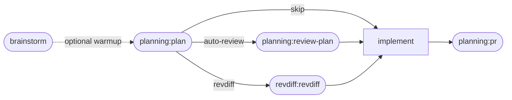
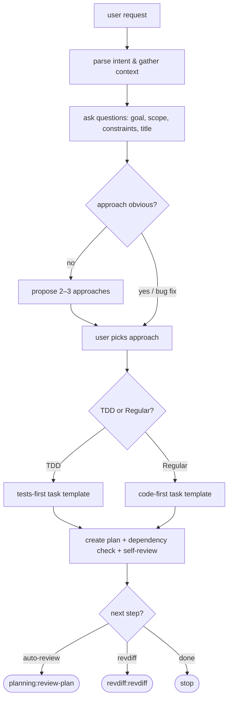
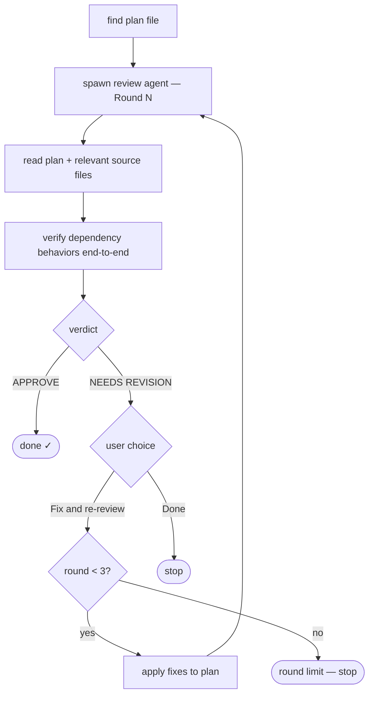
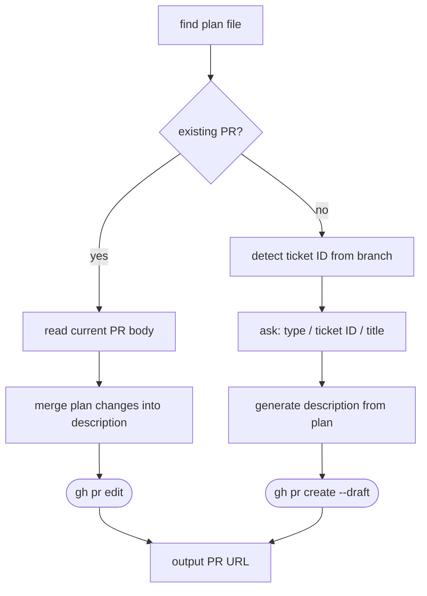

# claude-dlc

Personal Claude Code plugins and skills.

## Install

```
/plugin marketplace add parmaster/claude-dlc
```

Then install individual plugins:

```
/plugin install <plugin-name>@parmaster-claude-dlc
```

## Skill Workflows

The planning skills form a pipeline — each step is optional, drop in at any point:



## Plugins

### statusline

Custom status line (robbyrussell-style).

```
/plugin install statusline@parmaster-claude-dlc
```

Shows: current dir, git branch + dirty state (`✗`), model name, context %, 5h/7d usage rates with reset time.

After install, run `claude --init-only` once to trigger the setup hook — it writes `statusLine` into `~/.claude/settings.json`. Then relaunch Claude normally.

---

### planning

Structured implementation plan creation.

```
/plugin install planning@parmaster-claude-dlc
```

| Skill | Description |
|-------|-------------|
| `plan` | Create `docs/plans/YYYYMMDD-<name>.md` with context gathering and approach exploration. Offers auto-review and/or revdiff annotation at the end. |
| `review-plan` | Structured agent-based plan critique — correctness, over-engineering, test coverage, conventions. Presents findings by severity (Critical/Important/Minor) with APPROVE/NEEDS REVISION verdict. Iterates up to 3 rounds. Invoke on any plan: `/review-plan docs/plans/foo.md` |
| `pr` | Open a draft PR from the plan file — interactive title (`[feat\|fix\|chore]: TICKET-ID - title`) and plan-based description. If a PR already exists on the branch, reads the current description and amends it with the new plan's changes rather than replacing it. |

**`plan` — flow**



**`review-plan` — flow**



**`pr` — flow**



---

### brainstorm

Collaborative design dialogue before implementation.

```
/plugin install brainstorm@parmaster-claude-dlc
```

| Skill | Description |
|-------|-------------|
| `brainstorm` | Turn ideas into designs through one-at-a-time questions, approach exploration, and incremental validation. |

---

### style

Writing style for technical communication.

```
/plugin install style@parmaster-claude-dlc
```

| Skill | Description |
|-------|-------------|
| `writing-style` | Direct, brief style for PRs, Jira tickets, issue comments, commit messages. No AI-speak. |

---

### go-tools

Go development guards.

```
/plugin install go-tools@parmaster-claude-dlc
```

| Hook | Trigger | Effect |
|------|---------|--------|
| `block-explore-in-go` | `Agent` tool with `subagent_type=Explore` in a Go project | Denies and redirects to `gosymdb:sym` / `gosymdb:trace` / `gosymdb:impact` |
| `block-gosymdb-pipe` | `Bash` command containing `gosymdb \| python` or `gosymdb \| jq` | Denies with a reminder to read gosymdb JSON directly |

### global-rules

Shared global CLAUDE.md rules distributed across machines.

```
/plugin install global-rules@parmaster-claude-dlc
```

After install, run `claude --init-only` once to trigger the setup hook — it appends a single `@import` line to `~/.claude/CLAUDE.md` pointing at the plugin file. Existing content on any machine is untouched. Machine-specific rules stay in `~/.claude/CLAUDE.md` directly; shared rules live in the plugin and are updated on reinstall.

Includes: plan-first workflow, commit hygiene (tests + linter before commit), Go tooling (gosymdb), CLI best practices.

---

### git-tools

Git workflow skills.

```
/plugin install git-tools@parmaster-claude-dlc
```

| Skill | Description |
|-------|-------------|
| `squash-rebase` | Rebase onto main after a parent branch was squash-merged — auto-detects the cut point via file overlap heuristic, shows what will be dropped vs replayed, asks for confirmation before running `git rebase --onto`. |

---

## Local Development

Test a plugin from your local working tree without installing it:

```
claude --plugin-dir plugins/<name>
```

This loads the plugin directly from the repo directory. Skills, hooks, and commands are picked up from there instead of the installed cache, so edits take effect immediately.

Use `/reload-plugins` inside an active session to pick up file changes without restarting Claude.

Skills are invokable by full name (e.g. `/planning:plan`) but won't appear in the `/` autocomplete dropdown — only `commands/*.md` files do. Invoke them by typing the full name or via natural language.

To test the marketplace catalog itself (adding/removing plugins), edit `.claude-plugin/marketplace.json` and re-add the marketplace:

```
/plugin marketplace add parmaster/claude-dlc
```
