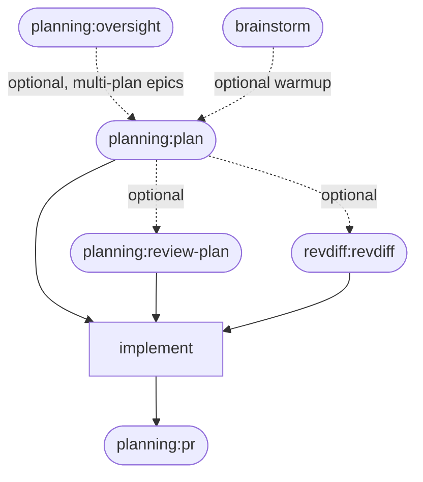
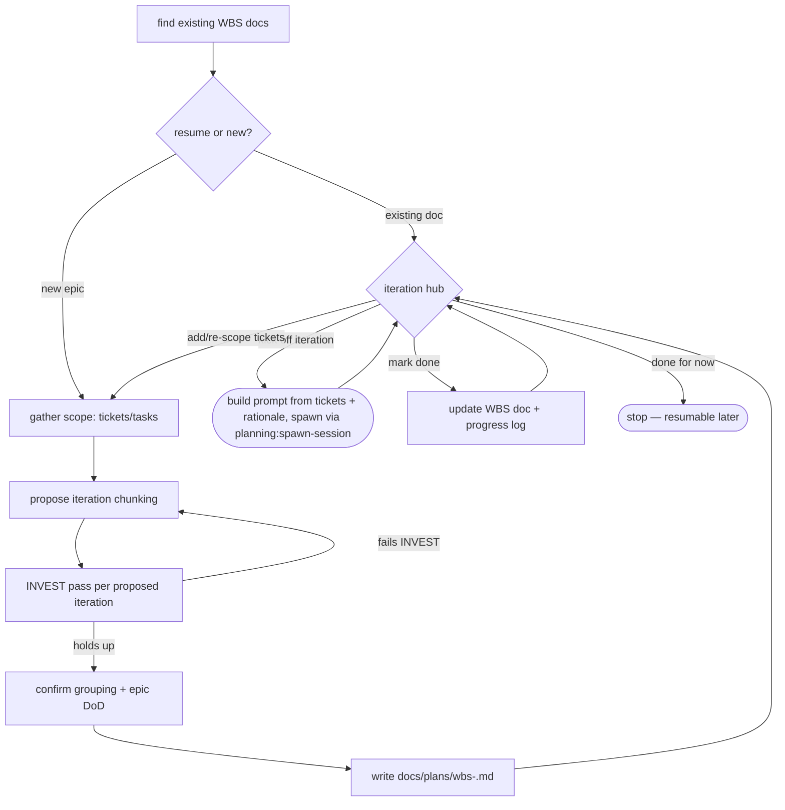
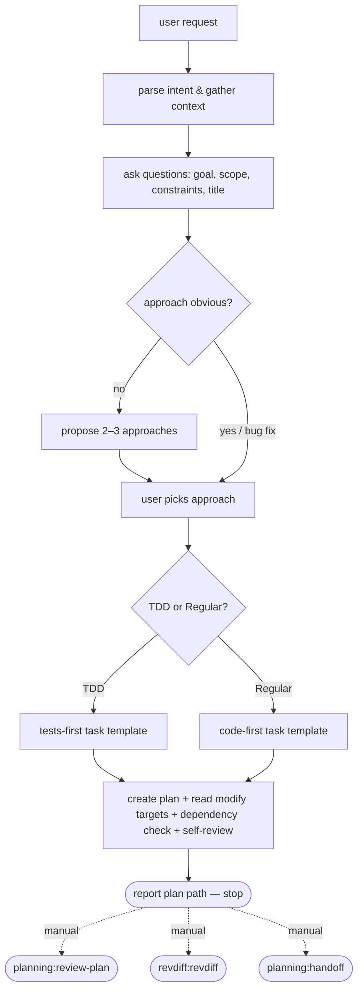
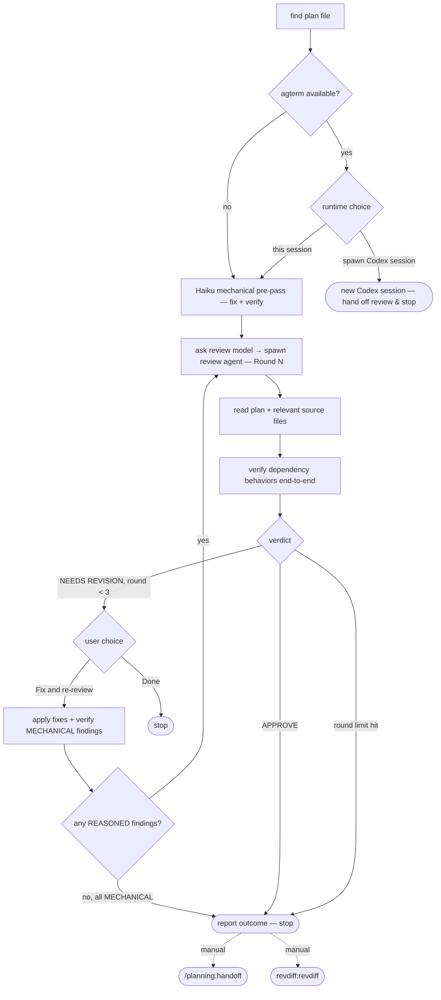

# claude-dlc

Personal Claude Code plugins and skills.

## Install

```
/plugin marketplace add parmaster/claude-dlc
```

Then install individual plugins:

```
/plugin install <plugin-name>@parmaster-claude-dlc
```

### Updating a plugin

Installed plugins stay pinned to their version. A session restart or `/reload-plugins` reloads the *currently pinned* version — neither pulls a newer one. To upgrade to a version you've pushed:

```
/plugin marketplace update parmaster-claude-dlc    # refresh the catalog so it sees the new version
/plugin install <plugin-name>@parmaster-claude-dlc # upgrades in place to the latest
/reload-plugins                                     # apply in the current session
```

The `marketplace update` step is the one that's easy to miss: without it, `/plugin install` reports "already installed" and no-ops, because the catalog still thinks your installed version is the latest. There's no separate `/plugin update` command — re-running `install` *is* the upgrade, once the catalog is refreshed. `/reload-plugins` prints a hook/skill/agent count, handy for confirming new components loaded (e.g. an added hook bumps the count).

To skip the manual steps, enable auto-update for the marketplace (off by default for third-party marketplaces): `/plugin` → **Marketplaces** → select `parmaster-claude-dlc` → **Enable auto-update**, or set `"autoUpdate": true` on the marketplace entry in `~/.claude/settings.json`. Claude then refreshes and upgrades at startup and prompts you to `/reload-plugins`.

For local development, `claude --plugin-dir plugins/<name>` bypasses the cache and loads straight from the working tree.

## Skill Workflows

The planning skills form a pipeline — each step is optional, drop in at any point:


```mermaid
flowchart TD
    OV(["planning:oversight"])
    BS(["brainstorm"])
    PL(["planning:plan"])
    RP(["planning:review-plan"])
    RD(["revdiff:revdiff"])
    IM["implement"]
    DPR(["planning:pr"])

    OV -.->|optional, multi-plan epics| PL
    BS -.->|optional warmup| PL
    PL -.->|optional| RP
    PL -.->|optional| RD
    PL --> IM
    RP --> IM
    RD --> IM
    IM --> DPR
```

## Plugins

### statusline

Custom status line (robbyrussell-style).

```
/plugin install statusline@parmaster-claude-dlc
```

Shows: current dir, git branch + dirty state (`✗`), model name, context %, 5h/7d usage rates with reset time.

After install, run `claude --init-only` once to trigger the setup hook — it writes `statusLine` into `~/.claude/settings.json`. Then relaunch Claude normally.

---

### planning

Structured implementation plan creation.

```
/plugin install planning@parmaster-claude-dlc
```

| Skill | Description |
|-------|-------------|
| `oversight` | Establish and track scope for a multi-plan epic before any of its iterations get individually planned — gathers tickets/tasks, proposes grouping them into iterations (only when planning tickets one-by-one would produce throwaway stubs later discarded by a grouped ticket's real implementation), then checks each proposed iteration against INVEST (Independent/Negotiable/Valuable/Estimable/Small/Testable) and pins down an epic-level Definition of Done. Persists to `docs/plans/wbs-<epic-slug>.md` — a distinct doc type from per-iteration plans, excluded from `review-plan`/`handoff`/`pr`'s "most recent plan" discovery so it's never picked up as one. Unlike `plan`/`review-plan`, this is meant to be revisited across the epic's lifetime: its iteration hub lets you kick off an iteration (spawns a new session via `planning:spawn-session`, passing a self-contained prompt built from that iteration's tickets and grouping rationale), mark an iteration done, or add/re-scope tickets, and resumes from the WBS doc if the session restarts mid-epic. |
| `plan` | Create `docs/plans/YYYYMMDD-<name>.md` with context gathering and approach exploration. Reports the created plan file path and stops — call `/planning:review-plan`, `revdiff:revdiff`, or `/planning:handoff` next. Self-review also traces error/status handling, walks test preconditions, and checks multi-phase state — the same depth the separate `review-plan` reviewer applies — and enforces a code-comment rule (no ticket IDs, links, PR numbers, commit SHAs, `(Slice N)` markers, or spec/doc pointers in example code). Discovery and dependency verification widen in a self-declared deep-discovery mode for multi-plan/large-feature work. Before writing a task, it reads in full every existing file that task lists under Create/Modify — plus the sibling test files any new test code reuses — so tasks are written against real helper signatures and existing assertions rather than guessed ones. |
| `review-plan` | Structured plan critique, run by a dedicated `plan-review` subagent (`agents/plan-review.md`) restricted to Read/Glob/Grep/Bash — no Write/Edit/NotebookEdit, so it can't create, modify, or delete files no matter what its prompt says. Before the first round, asks whether to review in this session (delegating each round to the subagent, as before) or hand the whole review off to a freshly spawned Codex CLI session running this same skill there — that choice only appears when the session is actually running inside agterm (`AGTERM_ENABLED=1`) and `agtermctl` is on PATH; it defaults straight to this session otherwise, without asking. Checks correctness, over-engineering, test coverage, conventions. Asks which model should run each review round (Opus/Sonnet) before every spawn — first review or a "Fix and re-review" continuation. Every finding is tagged MECHANICAL (backed by a `verify:` command) or REASONED (needs judgment); a finding that's a pattern repeated across multiple tasks gets every instance fixed in one pass, not just the flagged line, and a "needs more explanation" finding gets inlined rather than resolved with a pointer back to a spec or ticket; a fix pass that leaves only MECHANICAL findings gets its fixes verified by command instead of spawning another round. Rounds after the first scope the expensive dependency/error-tracing checks to just the sections the last round's fixes touched, instead of redoing the whole plan. Presents findings by severity (Critical/Important/Minor) with APPROVE/NEEDS REVISION verdict. Iterates up to 3 rounds, then reports the outcome and stops — call `/planning:handoff`, `revdiff:revdiff`, or begin implementation directly when ready. A Haiku mechanical pre-pass runs once before the first round and clears the grep-provable findings, without consuming the 3-round budget. The fix step verifies its own reasoned fixes against the source they make claims about, rather than leaving that for the next round. Invoke on any plan: `/review-plan docs/plans/foo.md` |
| `pr` | Open a draft PR from the plan file — interactive title (`[feat\|fix\|chore]: TICKET-ID - title`) and plan-based description. If a PR already exists on the branch, reads the current description and amends it with the new plan's changes rather than replacing it. |
| `handoff` | Explicit-only hand-off of a plan straight to a fresh agterm session, skipping `plan`/`review-plan`'s menus entirely — `/planning:handoff [plan-file]` (defaults to the most recent plan under `docs/plans/` if omitted). Asks which CLI to run the hand-off on — Claude or Codex — before the model question. Never triggers from natural language (`disable-model-invocation: true`). |
| `spawn-session` | Hand off an arbitrary task (not tied to a plan file) to a fresh, independent agterm session — triggers from natural language ("spawn a new session for this", "hand this off to a separate session", etc.) as well as `/planning:spawn-session [task]`. Asks which CLI to run it on — Claude or Codex — before the model question. Distinct from a background subagent: a real, visible terminal session the user can watch or drive directly. Can group related slices of one job under a shared named workspace. |

Three skills hand off to a fresh agterm session now that `plan` and `review-plan` no longer do it inline: `handoff` and `spawn-session` ask which CLI to run — Claude or Codex — then which model, and hand off implementation (`handoff`) or an arbitrary task (`spawn-session`). `review-plan` can additionally hand off the review itself (not implementation) to a Codex session, with no CLI or model choice — it always spawns `codex` with whatever model it's configured to use by default. `plan` no longer hands off anywhere; it reports the created file and stops. Every hand-off flags the new session (`agtermctl session flag on`), so all in-flight sessions show up in agterm's flagged sidebar view / flagged-dashboard grid instead of having to be found and flagged by hand. On the Claude path (`handoff`/`spawn-session` only), the model question is Inherit/Opus/Sonnet/Haiku, passed through as `claude --model`; on the Codex path it's Inherit or a free-typed model name (via the `AskUserQuestion` "Other" input), passed through as `codex --model` — Codex has no built-in model tiers to choose from. `handoff`'s implementation hand-off and `review-plan`'s review hand-off both launch in accept-edits-equivalent mode so they can start working right away — `claude --permission-mode acceptEdits` on the Claude path; on the Codex path, `review-plan` uses `codex --sandbox workspace-write --ask-for-approval never`, while `handoff` uses `codex --sandbox danger-full-access --ask-for-approval on-request` (workspace-write blocked tools like `gofmt`, `golangci-lint`, and `docker` from writing to caches/temp dirs outside the repo during implementation, so `handoff` trades the tighter sandbox for one that still pauses to ask when Codex judges an action risky); `spawn-session` starts with each CLI's own default permission/approval mode instead, since it hands off an arbitrary task rather than a plan already meant to be acted on.

**`oversight` — flow**


```mermaid
flowchart TD
    A["find existing WBS docs"] --> B{"resume or new?"}
    B -->|"existing doc"| H
    B -->|"new epic"| C["gather scope: tickets/tasks"]
    C --> D["propose iteration chunking"]
    D --> E["INVEST pass per proposed iteration"]
    E -->|"fails INVEST"| D
    E -->|"holds up"| F["confirm grouping + epic DoD"]
    F --> G["write docs/plans/wbs-<epic>.md"]
    G --> H{"iteration hub"}
    H -->|"kick off iteration"| K(["build prompt from tickets + rationale, spawn via planning:spawn-session"])
    K --> H
    H -->|"mark done"| U["update WBS doc + progress log"]
    U --> H
    H -->|"add/re-scope tickets"| C
    H -->|"done for now"| STOP(["stop — resumable later"])
```

**Tip: keep a long-lived `oversight` session's cache warm.** If it'll sit open for hours between check-ins (e.g. spawning one iteration a day and returning to it later), run `/loop 50m keepalive ping — no action, one-word ack` in that session. A cache read refreshes the 1h prompt-cache TTL for ~0.1× the cost of letting it go cold and re-processing the whole context on your next real check-in. `/usage` shows the current cache state (`warm`/`miss`, time since last activity) to confirm it's working.

**`plan` — flow**


```mermaid
flowchart TD
    A["user request"] --> B["parse intent & gather context"]
    B --> C["ask questions: goal, scope, constraints, title"]
    C --> D{"approach obvious?"}
    D -->|no| E["propose 2–3 approaches"]
    E --> F["user picks approach"]
    D -->|"yes / bug fix"| F
    F --> G{"TDD or Regular?"}
    G -->|TDD| H["tests-first task template"]
    G -->|Regular| I["code-first task template"]
    H --> J["create plan + read modify targets + dependency check + self-review"]
    I --> J
    J --> K(["report plan path — stop"])
    K -.->|manual| L(["planning:review-plan"])
    K -.->|manual| RD(["revdiff:revdiff"])
    K -.->|manual| SESS(["planning:handoff"])
```

**`review-plan` — flow**


```mermaid
flowchart TD
    A["find plan file"] --> A1{"agterm available?"}
    A1 -->|no| A2["Haiku mechanical pre-pass — fix + verify"]
    A1 -->|yes| A15{"runtime choice"}
    A15 -->|"this session"| A2
    A15 -->|"spawn Codex session"| CX(["new Codex session — hand off review & stop"])
    A2 --> B["ask review model → spawn review agent — Round N"]
    B --> C["read plan + relevant source files"]
    C --> D["verify dependency behaviors end-to-end"]
    D --> E{"verdict"}
    E -->|"NEEDS REVISION, round < 3"| G{"user choice"}
    G -->|"Fix and re-review"| H["apply fixes + verify MECHANICAL findings"]
    H --> H2{"any REASONED findings?"}
    H2 -->|yes| B
    H2 -->|"no, all MECHANICAL"| M
    G -->|Done| STOP(["stop"])
    E -->|APPROVE| M(["report outcome — stop"])
    E -->|"round limit hit"| M
    M -.->|manual| SESS(["/planning:handoff"])
    M -.->|manual| RD(["revdiff:revdiff"])
```

**`pr` — flow**


```mermaid
flowchart TD
    A["find plan file"] --> B{"existing PR?"}
    B -->|yes| C["read current PR body"]
    C --> D["merge plan changes into description"]
    D --> E(["gh pr edit"])
    B -->|no| F["detect ticket ID from branch"]
    F --> G["ask: type / ticket ID / title"]
    G --> H["generate description from plan"]
    H --> I(["gh pr create --draft"])
    E --> J["output PR URL"]
    I --> J
```

---

### brainstorm

Collaborative design dialogue before implementation.

```
/plugin install brainstorm@parmaster-claude-dlc
```

| Skill | Description |
|-------|-------------|
| `brainstorm` | Turn ideas into designs through one-at-a-time questions, approach exploration, and incremental validation. |

---

### style

Writing style for technical communication.

```
/plugin install style@parmaster-claude-dlc
```

| Skill | Description |
|-------|-------------|
| `writing-style` | Direct, brief style for PRs, Jira tickets, issue comments, commit messages. No AI-speak. |

---

### global-rules

Shared global CLAUDE.md rules distributed across machines.

```
/plugin install global-rules@parmaster-claude-dlc
```

After install, run `claude --init-only` once to trigger the setup hook — it appends a single `@import` line to `~/.claude/CLAUDE.md` pointing at the plugin file, and makes three additions to `~/.claude/settings.json`: `CLAUDE_AFK_TIMEOUT_MS=86400000` (24h) so `AskUserQuestion` dialogs (e.g. `review-plan`'s runtime/model-choice prompts) don't auto-submit after the 60s default, `ScheduleWakeup` in `permissions.deny` — self-scheduled wakeups were only ever used to poll work the harness already reports on completion, so each firing was a wasted turn — and `bashOutputMaxChars: 4000` (the harness floor) so a Bash command's output past that size is saved to a file and previewed instead of dumped into context, regardless of what command produced it (`tail`, `cat`, a script). Denying `ScheduleWakeup` also means a bare `/loop` with no interval runs once instead of pacing itself; `/loop <interval>` is unaffected. All steps are additive and idempotent — existing content and any value you've already set yourself are left untouched. Machine-specific rules stay in `~/.claude/CLAUDE.md` directly; shared rules live in the plugin and are updated on reinstall.

Includes: plan-first workflow (re-invoke a skill via the Skill tool on repeat use rather than replaying it from memory), commit hygiene (tests + linter before commit, no co-authored-by tag lines), git hygiene (stale-branch resync before planning and before the final commit), CLI best practices, a longer `AskUserQuestion` timeout, auto-memory discipline (confirm before writing memories, except on explicit request), response brevity (short answers, plain words, text diagrams over prose), Atlassian MCP hygiene (delegate all Jira/Confluence MCP work to a dedicated `atlassian-caller` subagent that has no Agent tool of its own — one spawn per goal, not per call — and scope the requested fields).

| Hook | Trigger | Effect |
|------|---------|--------|
| `block-root-find` | `Bash` command running `find` rooted at `/` (e.g. `find / -type d ...`), including inside `$(...)` command substitution or a variable assignment | Denies — full-filesystem scans aren't a normal part of any task; scope the search to a specific directory instead |
| `block-coauthor` | `Bash` command running `git commit`/`git commit --amend` or `gh pr create`/`gh pr edit` whose command string contains a `Co-Authored-By` line | Denies — this repo's commit-hygiene rule says never to include one; remove it and retry |

---

### git-tools

Git workflow skills.

```
/plugin install git-tools@parmaster-claude-dlc
```

| Skill | Description |
|-------|-------------|
| `squash-rebase` | Rebase onto main after a parent branch was squash-merged — auto-detects the cut point via file overlap heuristic, shows what will be dropped vs replayed, asks for confirmation before running `git rebase --onto`. |

---

## Local Development

Test a plugin from your local working tree without installing it:

```
claude --plugin-dir plugins/<name>
```

This loads the plugin directly from the repo directory. Skills, hooks, and commands are picked up from there instead of the installed cache, so edits take effect immediately.

Use `/reload-plugins` inside an active session to pick up file changes without restarting Claude.

Skills are invokable by full name (e.g. `/planning:plan`) and appear in the `/` autocomplete dropdown the same as `commands/*.md` files — `commands/` is legacy-only now.

To test the marketplace catalog itself (adding/removing plugins), edit `.claude-plugin/marketplace.json` and re-add the marketplace:

```
/plugin marketplace add parmaster/claude-dlc
```
