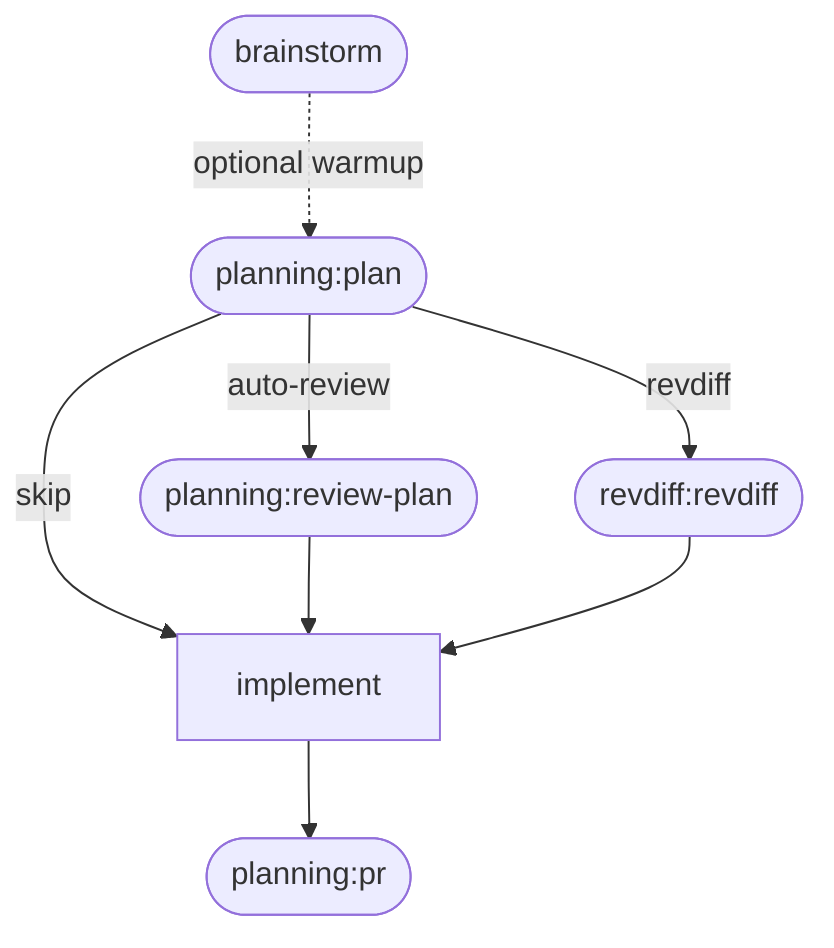
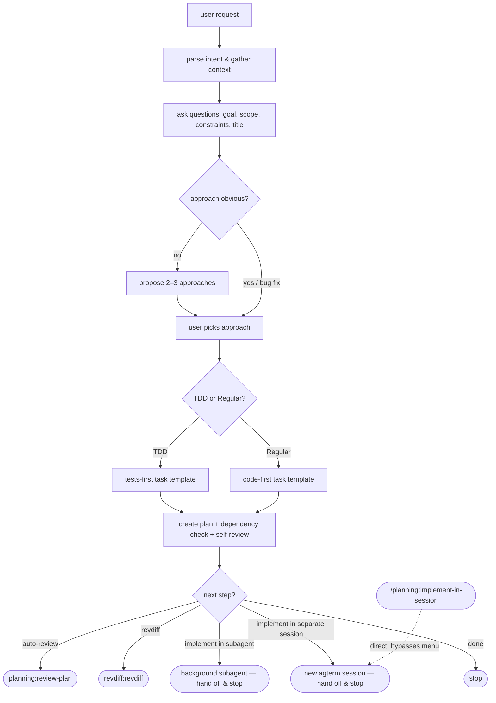
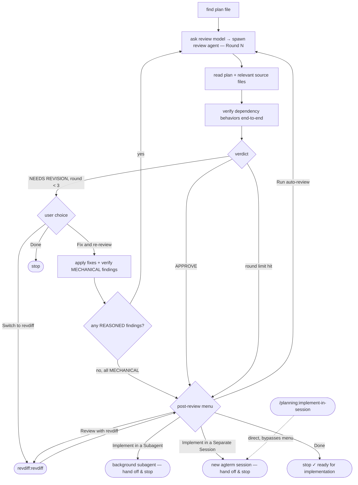
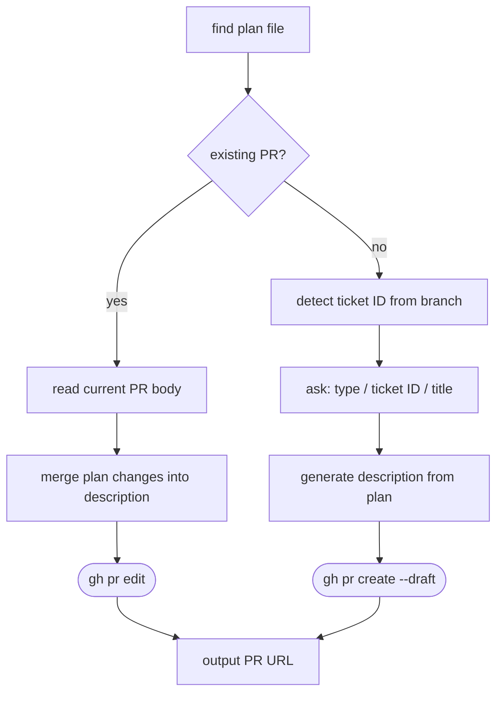

# claude-dlc

Personal Claude Code plugins and skills.

## Install

```
/plugin marketplace add parmaster/claude-dlc
```

Then install individual plugins:

```
/plugin install <plugin-name>@parmaster-claude-dlc
```

### Updating a plugin

Installed plugins stay pinned to their version. A session restart or `/reload-plugins` reloads the *currently pinned* version — neither pulls a newer one. To upgrade to a version you've pushed:

```
/plugin marketplace update parmaster-claude-dlc    # refresh the catalog so it sees the new version
/plugin install <plugin-name>@parmaster-claude-dlc # upgrades in place to the latest
/reload-plugins                                     # apply in the current session
```

The `marketplace update` step is the one that's easy to miss: without it, `/plugin install` reports "already installed" and no-ops, because the catalog still thinks your installed version is the latest. There's no separate `/plugin update` command — re-running `install` *is* the upgrade, once the catalog is refreshed. `/reload-plugins` prints a hook/skill/agent count, handy for confirming new components loaded (e.g. an added hook bumps the count).

To skip the manual steps, enable auto-update for the marketplace (off by default for third-party marketplaces): `/plugin` → **Marketplaces** → select `parmaster-claude-dlc` → **Enable auto-update**, or set `"autoUpdate": true` on the marketplace entry in `~/.claude/settings.json`. Claude then refreshes and upgrades at startup and prompts you to `/reload-plugins`.

For local development, `claude --plugin-dir plugins/<name>` bypasses the cache and loads straight from the working tree.

## Skill Workflows

The planning skills form a pipeline — each step is optional, drop in at any point:


```mermaid
flowchart TD
    BS(["brainstorm"])
    PL(["planning:plan"])
    RP(["planning:review-plan"])
    RD(["revdiff:revdiff"])
    IM["implement"]
    DPR(["planning:pr"])

    BS -.->|optional warmup| PL
    PL -->|auto-review| RP
    PL -->|revdiff| RD
    PL -->|skip| IM
    RP --> IM
    RD --> IM
    IM --> DPR
```

## Plugins

### statusline

Custom status line (robbyrussell-style).

```
/plugin install statusline@parmaster-claude-dlc
```

Shows: current dir, git branch + dirty state (`✗`), model name, context %, 5h/7d usage rates with reset time.

After install, run `claude --init-only` once to trigger the setup hook — it writes `statusLine` into `~/.claude/settings.json`. Then relaunch Claude normally.

---

### planning

Structured implementation plan creation.

```
/plugin install planning@parmaster-claude-dlc
```

| Skill | Description |
|-------|-------------|
| `plan` | Create `docs/plans/YYYYMMDD-<name>.md` with context gathering and approach exploration. Offers auto-review, revdiff annotation, hand off to a background subagent, or hand off to a fresh agterm session at the end. |
| `review-plan` | Structured plan critique, run by a dedicated `plan-review` subagent (`agents/plan-review.md`) restricted to Read/Glob/Grep/Bash — no Write/Edit/NotebookEdit, so it can't create, modify, or delete files no matter what its prompt says. Checks correctness, over-engineering, test coverage, conventions. Asks which model should run each review round (Inherit/Opus/Sonnet/Haiku) before every spawn — first review, "Fix and re-review", or "Run auto-review". Every finding is tagged MECHANICAL (backed by a `verify:` command) or REASONED (needs judgment); a fix pass that leaves only MECHANICAL findings gets its fixes verified by command and skips straight to the post-review menu instead of spawning another round. Rounds after the first scope the expensive dependency/error-tracing checks to just the sections the last round's fixes touched, instead of redoing the whole plan. Presents findings by severity (Critical/Important/Minor) with APPROVE/NEEDS REVISION verdict. Iterates up to 3 rounds, then lands on a "what's next" menu (re-run auto-review, switch to revdiff, hand off to a background implementation subagent — choosing which model it runs on, hand off to a fresh agterm session, or Done) that keeps re-asking until Done is explicitly chosen. The agterm hand-off only appears when the session is actually running inside agterm (`AGTERM_ENABLED=1`) and `agtermctl` is on PATH — it's silently omitted otherwise. Invoke on any plan: `/review-plan docs/plans/foo.md` |
| `pr` | Open a draft PR from the plan file — interactive title (`[feat\|fix\|chore]: TICKET-ID - title`) and plan-based description. If a PR already exists on the branch, reads the current description and amends it with the new plan's changes rather than replacing it. |
| `implement-in-session` | Explicit-only hand-off of a plan straight to a fresh agterm session, skipping `plan`/`review-plan`'s menus entirely — `/planning:implement-in-session [plan-file]` (defaults to the most recent plan under `docs/plans/` if omitted). Never triggers from natural language (`disable-model-invocation: true`). |

Every agterm hand-off (`plan`, `review-plan`, `implement-in-session`) also flags the new session (`agtermctl session flag on`), so all in-flight implementations show up in agterm's flagged sidebar view / flagged-dashboard grid instead of having to be found and flagged by hand.

**`plan` — flow**


```mermaid
flowchart TD
    A["user request"] --> B["parse intent & gather context"]
    B --> C["ask questions: goal, scope, constraints, title"]
    C --> D{"approach obvious?"}
    D -->|no| E["propose 2–3 approaches"]
    E --> F["user picks approach"]
    D -->|"yes / bug fix"| F
    F --> G{"TDD or Regular?"}
    G -->|TDD| H["tests-first task template"]
    G -->|Regular| I["code-first task template"]
    H --> J["create plan + dependency check + self-review"]
    I --> J
    J --> K{"next step?"}
    K -->|auto-review| L(["planning:review-plan"])
    K -->|revdiff| M(["revdiff:revdiff"])
    K -->|"implement in subagent"| SUB(["background subagent — hand off & stop"])
    K -->|"implement in separate session"| SESS(["new agterm session — hand off & stop"])
    K -->|done| N(["stop"])
    EXT(["/planning:implement-in-session"]) -.->|direct, bypasses menu| SESS
```

**`review-plan` — flow**


```mermaid
flowchart TD
    A["find plan file"] --> B["ask review model → spawn review agent — Round N"]
    B --> C["read plan + relevant source files"]
    C --> D["verify dependency behaviors end-to-end"]
    D --> E{"verdict"}
    E -->|"NEEDS REVISION, round < 3"| G{"user choice"}
    G -->|"Fix and re-review"| H["apply fixes + verify MECHANICAL findings"]
    H --> H2{"any REASONED findings?"}
    H2 -->|yes| B
    H2 -->|"no, all MECHANICAL"| M
    G -->|"Switch to revdiff"| RD(["revdiff:revdiff"])
    G -->|Done| STOP(["stop"])
    E -->|APPROVE| M{"post-review menu"}
    E -->|"round limit hit"| M
    M -->|"Run auto-review"| B
    M -->|"Review with revdiff"| RD
    RD --> M
    M -->|"Implement in a Subagent"| SUB(["background subagent — hand off & stop"])
    M -->|"Implement in a Separate Session"| SESS(["new agterm session — hand off & stop"])
    M -->|Done| STOP2(["stop ✓ ready for implementation"])
    EXT(["/planning:implement-in-session"]) -.->|direct, bypasses menu| SESS
```

**`pr` — flow**


```mermaid
flowchart TD
    A["find plan file"] --> B{"existing PR?"}
    B -->|yes| C["read current PR body"]
    C --> D["merge plan changes into description"]
    D --> E(["gh pr edit"])
    B -->|no| F["detect ticket ID from branch"]
    F --> G["ask: type / ticket ID / title"]
    G --> H["generate description from plan"]
    H --> I(["gh pr create --draft"])
    E --> J["output PR URL"]
    I --> J
```

---

### agterm-hooks

Flags Claude Code's session status in agterm's sidebar.

```
/plugin install agterm-hooks@parmaster-claude-dlc
```

Applies to any Claude Code session running inside agterm — not tied to `planning`'s hand-off flow. No-op outside agterm (`AGTERM_ENABLED` unset) or when `agtermctl` isn't on `PATH`.

| Hook | Trigger | Effect |
|------|---------|--------|
| `stop-status` | `Stop` — Claude Code finishes responding | Flags the session `completed` in agterm's sidebar, with the system alert sound. `--auto-reset` clears it back to idle once you next look at the session. |
| `notification-status` | `Notification` — Claude Code needs permission or has been idle-waiting for input | Flags the session `blocked` in agterm's sidebar. No sound is forced — agterm plays your own configured "Blocked sound" setting (Settings ▸ Appearance ▸ Agent Status) if you've set one. |

---

### brainstorm

Collaborative design dialogue before implementation.

```
/plugin install brainstorm@parmaster-claude-dlc
```

| Skill | Description |
|-------|-------------|
| `brainstorm` | Turn ideas into designs through one-at-a-time questions, approach exploration, and incremental validation. |

---

### style

Writing style for technical communication.

```
/plugin install style@parmaster-claude-dlc
```

| Skill | Description |
|-------|-------------|
| `writing-style` | Direct, brief style for PRs, Jira tickets, issue comments, commit messages. No AI-speak. |

---

### go-tools

Go development guards.

```
/plugin install go-tools@parmaster-claude-dlc
```

| Hook | Trigger | Effect |
|------|---------|--------|
| `block-explore-in-go` | `Agent` tool with `subagent_type=Explore` in a Go project **and** a prompt signalling Go-symbol intent (`func`/`type`/`interface`/`struct`/`method`/`symbol`/`caller`/`implementation`/`.go`, …) | Denies and redirects to `gosymdb:sym` / `gosymdb:trace` / `gosymdb:impact`. General non-symbol exploration passes through. |
| `block-gosymdb-pipe` | `Bash` command containing `gosymdb \| python` or `gosymdb \| jq` | Denies with a reminder to read gosymdb JSON directly |
| `block-go-symbol-grep` | `Bash` grep/rg/git-grep that targets `.go` files, or searches for a Go declaration keyword (`func`/`type`/`interface`/`struct`) inside a Go module | Denies and redirects to `gosymdb:sym` / `gosymdb:trace` / `gosymdb:impact` |

### global-rules

Shared global CLAUDE.md rules distributed across machines.

```
/plugin install global-rules@parmaster-claude-dlc
```

After install, run `claude --init-only` once to trigger the setup hook — it appends a single `@import` line to `~/.claude/CLAUDE.md` pointing at the plugin file, and sets `CLAUDE_AFK_TIMEOUT_MS=86400000` (24h) in `~/.claude/settings.json` so `AskUserQuestion` dialogs (e.g. `review-plan`'s post-review menu) don't auto-submit after the 60s default. Both steps are additive and idempotent — existing content and any value you've already set yourself are left untouched. Machine-specific rules stay in `~/.claude/CLAUDE.md` directly; shared rules live in the plugin and are updated on reinstall.

Includes: plan-first workflow, commit hygiene (tests + linter before commit), git hygiene (stale-branch resync before planning and before the final commit), CLI best practices, a longer `AskUserQuestion` timeout, auto-memory discipline (confirm before writing memories, except on explicit request), response brevity (short answers, plain words, text diagrams over prose).

| Hook | Trigger | Effect |
|------|---------|--------|
| `block-root-find` | `Bash` command running `find` rooted at `/` (e.g. `find / -type d ...`), including inside `$(...)` command substitution or a variable assignment | Denies — full-filesystem scans aren't a normal part of any task; scope the search to a specific directory instead |

---

### git-tools

Git workflow skills.

```
/plugin install git-tools@parmaster-claude-dlc
```

| Skill | Description |
|-------|-------------|
| `squash-rebase` | Rebase onto main after a parent branch was squash-merged — auto-detects the cut point via file overlap heuristic, shows what will be dropped vs replayed, asks for confirmation before running `git rebase --onto`. |

---

## Local Development

Test a plugin from your local working tree without installing it:

```
claude --plugin-dir plugins/<name>
```

This loads the plugin directly from the repo directory. Skills, hooks, and commands are picked up from there instead of the installed cache, so edits take effect immediately.

Use `/reload-plugins` inside an active session to pick up file changes without restarting Claude.

Skills are invokable by full name (e.g. `/planning:plan`) and appear in the `/` autocomplete dropdown the same as `commands/*.md` files — `commands/` is legacy-only now.

To test the marketplace catalog itself (adding/removing plugins), edit `.claude-plugin/marketplace.json` and re-add the marketplace:

```
/plugin marketplace add parmaster/claude-dlc
```
