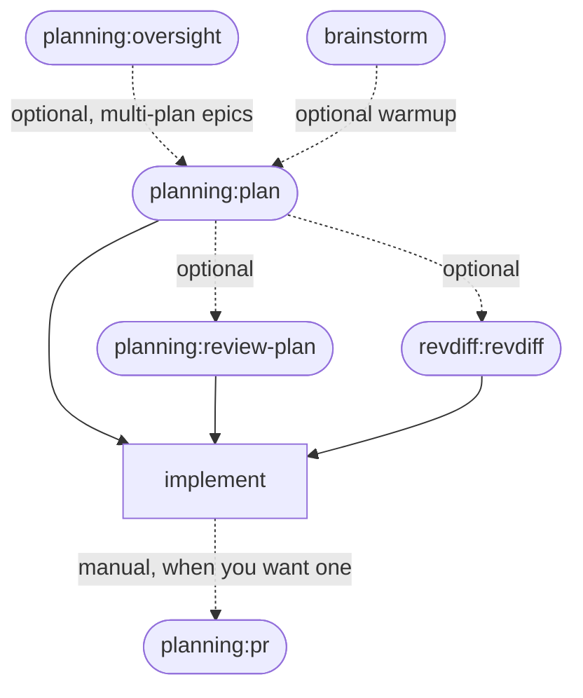

# claude-dlc

Personal Claude Code plugins and skills.

## Install

```
/plugin marketplace add parmaster/claude-dlc
/plugin install <plugin-name>@parmaster-claude-dlc
```

### Updating

Installed plugins stay pinned to their version. To pick up a newer one:

```
/plugin marketplace update parmaster-claude-dlc    # refresh the catalog first
/plugin install <plugin-name>@parmaster-claude-dlc # re-running install is the upgrade
/reload-plugins
```

Skip the `marketplace update` step and `install` just says "already installed". To automate this, enable auto-update under `/plugin` → **Marketplaces** → `parmaster-claude-dlc`.

## Planning workflow

Every step is optional, drop in at any point:


```mermaid
flowchart TD
    OV(["planning:oversight"])
    BS(["brainstorm"])
    PL(["planning:plan"])
    RP(["planning:review-plan"])
    RD(["revdiff:revdiff"])
    IM["implement"]
    DPR(["planning:pr"])

    OV -.->|optional, multi-plan epics| PL
    BS -.->|optional warmup| PL
    PL -.->|optional| RP
    PL -.->|optional| RD
    PL --> IM
    RP --> IM
    RD --> IM
    IM -.->|manual, when you want one| DPR
```

## Plugins

### statusline

Custom status line (robbyrussell-style).

#### Claude Code

```
/plugin install statusline@parmaster-claude-dlc
```

Shows: current dir, git branch + dirty state (`✗`), model name, context %, 5h/7d usage rates with reset time.

After install, run `claude --init-only` once to trigger the setup hook — it writes `statusLine` into `~/.claude/settings.json`. Then relaunch Claude normally.

#### Codex

Codex uses its native footer renderer. From this repository, run:

```bash
bash plugins/statusline/scripts/setup-codex.sh
```

Restart Codex after setup. The footer shows the current directory, Git branch, model and reasoning effort, context use, five-hour use, and weekly use. Codex controls the colors and labels; its native footer does not expose the Claude line's prompt symbol, dirty-tree marker, custom context color, or reset time.

---

### planning

Plans, plan reviews, a backlog, and PRs. Handing work to a fresh session goes through the `agterm` plugin below.

```
/plugin install planning@parmaster-claude-dlc
```

| Skill | What it does |
|-------|--------------|
| `oversight` | Scopes a multi-plan epic: groups tickets into iterations, checks each against INVEST, sets an epic-level Definition of Done. Tracks progress in `docs/plans/wbs-<epic>.md` and can spawn a session per iteration through `agterm:spawn-session`. Meant to be revisited over the epic's lifetime. |
| `plan` | Writes `docs/plans/YYYY-MM-DD-<name>.md` at the level of intent: goal, decisions, constraints, traps (code that doesn't do what its name says, leftover state), and a Definition of Done where each item names its proof. No code — the implementer picks it. Test order follows the kind of change: a bug fix starts with a failing test that reproduces it, a refactor pins behavior with tests first. Sized to read and think through in about ten minutes; past ~150 lines it suggests splitting the change. Stops after writing the file. |
| `review-plan` | One review pass via a read-only `plan-review` subagent: does the DoD prove the intent, do the decisions hold up against the code, is a trap missing, is scope right. "Nothing to flag" is a normal result. Findings are "Should fix" or "Consider"; you pick which to apply. Inside agterm it can hand the review off to a fresh Claude or Codex session through `agterm:spawn-session`. |
| `backlog` | Keeps deferred work in `docs/backlog/<slug>.md`, one file per item, triaged `worth: yes/later/no`, with an optional `ticket:` link to a Jira ticket. Lists and verifies items, walks them one at a time (`--all`) or opens one (`<slug>`) to fix or drop; a fix deletes the file in the same commit. `--dashboard` builds a single HTML page of the whole store (stat tiles that filter by worth, last 7 days, `where` not found and uncommitted; search; sort; area chips; rows that expand to the item body) and opens it through `agterm:overlay`, or prints its path outside agterm. Files new items after dedupe, on the default branch or on a feature branch whose changes touch the item's file; asks otherwise. `plan` offers matching `worth: yes` items for the plan, and `review-plan` offers to file out-of-scope findings here. Adapted from [cc-thingz](https://github.com/umputun/cc-thingz). |
| `pr` | Opens a draft PR from the plan file, or amends the description if a PR already exists. |

Without the `agterm` plugin, `review-plan` reviews in the current session and `oversight` prints the iteration prompt for you to paste into a session you open yourself.

**Tip:** to keep a long-lived `oversight` session's prompt cache warm between check-ins, run `/loop 50m keepalive ping — no action, one-word ack` in it.

---

### brainstorm

Collaborative design dialogue before implementation.

```
/plugin install brainstorm@parmaster-claude-dlc
```

| Skill | What it does |
|-------|--------------|
| `brainstorm` | Turns ideas into designs through one-at-a-time questions and incremental validation. |

---

### style

Writing style for technical communication.

```
/plugin install style@parmaster-claude-dlc
```

| Skill | What it does |
|-------|--------------|
| `writing-style` | Direct, brief style for PRs, tickets, issue comments, and commit messages. No AI-speak. |

---

### git-tools

```
/plugin install git-tools@parmaster-claude-dlc
```

| Skill | What it does |
|-------|--------------|
| `squash-rebase` | Rebases onto main after a parent branch was squash-merged. Finds the cut point, shows what gets dropped vs replayed, and asks before running `git rebase --onto`. |

---

### agterm

Helpers for [agterm](https://github.com/umputun/agterm): open things in an overlay (a panel floating over the current session that closes on `q` (glow), Cmd-W or its close button), and hand a plan or a task off to a fresh session.

```
/plugin install agterm@parmaster-claude-dlc
```

| Skill | What it does |
|-------|--------------|
| `overlay` | Opens a markdown file in `glow`, a local HTML file, or a URL. "Open the latest plan in glow" picks the newest file in `docs/plans/`, then `docs/plans/completed/`. Also triggers on "open <file> in an overlay", "show <file.html> in agterm", "open <url> in an overlay", or `/agterm:overlay [file\|url]`. HTML files and URLs open with JavaScript off unless `--js` is added. |
| `handoff` | Sends a plan from `docs/plans/` to a fresh agterm session on Claude or Codex. Explicit-only: `/agterm:handoff [plan-file]`. |
| `spawn-session` | Sends an arbitrary task to a fresh agterm session on Claude or Codex. Also triggers from natural language ("spawn a new session for this"). |

Claude hand-off sessions start in auto mode, or accept-edits when an org setting turns auto mode off. Hand-off sessions are flagged (`agtermctl session flag on`) so in-flight work shows up in agterm's flagged view.

A PreToolUse hook approves the `overlay` skill's own script calls, so it works in auto mode with no permission rule in settings. The hook approves only a single plain call of the plugin's `overlay.sh` with `md`, `html` or `url`, and stays silent for anything else. The script only ever runs `agtermctl session overlay open|result` against `$AGTERM_SESSION_ID`, and fails with a clear message outside agterm or when an overlay is already open. It can't run arbitrary programs; use agterm's own `agterm` skill for that.

#### Optional agterm key commands

Two custom commands for agterm's `~/.config/agterm/keymap.conf` that open an overlay straight from a key, without going through Claude. Paste the ones you want, change the chords to taste, then run `agtermctl keymap reload`. Each is a single line.

**Backlog Dashboard** builds the `planning` plugin's backlog dashboard for the session's repo and opens it. It needs the `planning` plugin from this marketplace, `git` and `jq`. In a folder with no backlog it shows the reason as a short message.

```
command "Backlog Dashboard" cmd+shift+b cd "$AGT_SESSION_PWD" && f=$(bash ~/.claude/plugins/marketplaces/parmaster-claude-dlc/plugins/planning/scripts/backlog-dashboard.sh 2>&1) && { agtermctl session overlay open --html "$f" --cwd "$(dirname "$f")" --navigation --js --size-percent 90 --target "$AGT_SESSION_ID" --socket "$AGT_SOCKET"; exit; }; agtermctl session hud "${f:-Backlog Dashboard failed}" --hide-after 4 --target "$AGT_SESSION_ID" --socket "$AGT_SOCKET"
```

**Glow Selection** opens the selected file path in `glow`. With nothing selected in agterm it uses the clipboard, which covers a program that captures the mouse and keeps its own selection (Claude Code in fullscreen mode). Spaces and backticks around the path are trimmed; a path that isn't a file gets a short "no such file" message.

```
command "Glow Selection" cmd+shift+g f=$AGT_SELECTION; [ -n "$f" ] || f=$(pbpaste); f=$(printf %s "$f" | head -1 | sed 's/^[[:space:]`]*//; s/[[:space:]`]*$//' | cut -c1-200); cd "$AGT_SESSION_PWD" && [ -f "$f" ] && { agtermctl session overlay open "zsh -lc 'glow -p \"\$1\"' glow $(printf %q "$f")" --cwd "$AGT_SESSION_PWD" --size-percent 90 --target "$AGT_SESSION_ID" --socket "$AGT_SOCKET"; exit; }; agtermctl session hud "Glow Selection: no such file: $f" --hide-after 4 --target "$AGT_SESSION_ID" --socket "$AGT_SOCKET"
```

---

### statusline

Custom status line: dir, git branch and dirty state, model, context %, 5h/7d usage.

```
/plugin install statusline@parmaster-claude-dlc
```

Run `claude --init-only` once after install to write `statusLine` into `~/.claude/settings.json`, then relaunch.

---

### global-rules

Shared global `CLAUDE.md` rules, synced across machines.

```
/plugin install global-rules@parmaster-claude-dlc
```

Run `claude --init-only` once after install. The setup hook is additive and idempotent, and never overrides values you've set. It:

- adds an `@import` line to `~/.claude/CLAUDE.md` pointing at the plugin's rules
- sets `CLAUDE_AFK_TIMEOUT_MS` to 24h so `AskUserQuestion` dialogs don't auto-submit after 60s
- denies `ScheduleWakeup` (a bare `/loop` with no interval then runs once; `/loop <interval>` still works)
- sets `bashOutputMaxChars: 4000` so large Bash output is saved to a file and previewed instead of flooding context
- replaces the spinner's whimsical verbs ("Kerfuffling…") with `Thinking` / `Processing` / `Working`
- sets `attribution` to `{"commit": "", "pr": ""}` so Claude Code doesn't add a Co-Authored-By trailer or PR attribution line

The rules cover plan-first workflow, git hygiene, tests and lint before commit, response brevity, and memory and Atlassian MCP discipline.

| Hook | Effect |
|------|--------|
| `block-root-find` | Denies `find` rooted at `/`. Scope the search to a directory. |
| `block-coauthor` | Denies `git commit` / `gh pr create` / `gh pr edit` with a `Co-Authored-By` line or a claude.ai session link (`Claude-Session:` trailer). |
| `block-inline-edit` | Denies file edits through an inline python/node/ruby script or `sed -i` / `perl -i`, and points to the Edit tool instead. `perl -i` on `docs/plans/` is allowed (checkbox ticking). |
| `block-comment-refs` | Denies Edit/Write when a *new* comment line in a code file points somewhere instead of explaining: a ticket ID, a Jira/Confluence/PR link, a commit SHA, a slice marker, or a path to a `docs/plans`/`docs/specs` doc. Standard names (UTF-8, SHA-256, RFC-7231…), Markdown and existing comments pass. |

---

## Local development

```
claude --plugin-dir plugins/<name>   # load a plugin straight from the working tree
/reload-plugins                      # pick up edits without restarting
```

To test the marketplace catalog itself, edit `.claude-plugin/marketplace.json` and re-run `/plugin marketplace add parmaster/claude-dlc`.
