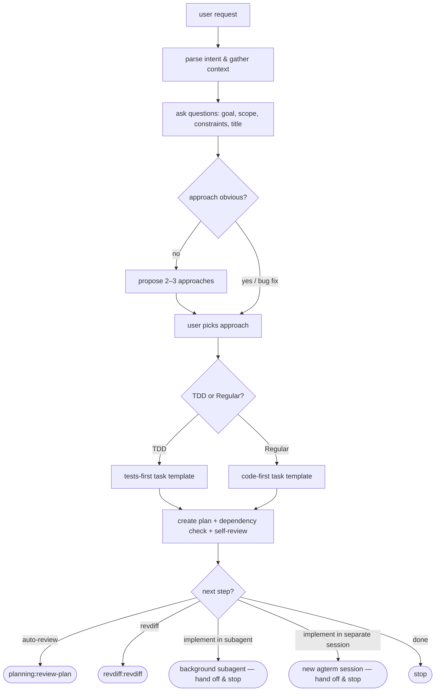
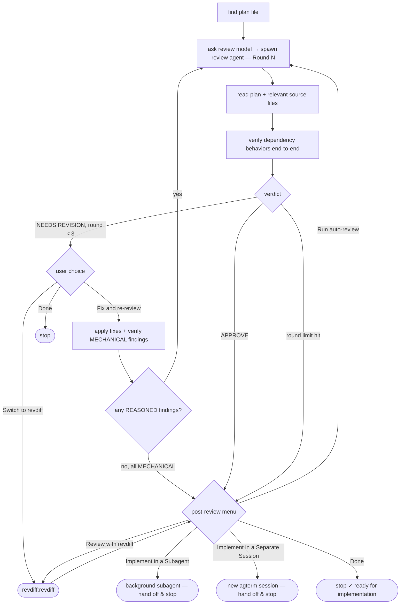

# Implement in a Separate agterm Session

**Goal:** Add an "Implement in a Separate Session" option — alongside the existing "Implement in a Subagent" option — to both `planning:plan`'s Step 3 menu and `planning:review-plan`'s Step 5 post-review menu, that hands off implementation to a brand-new agterm terminal session (running a fresh `claude` CLI invocation) instead of a background subagent.

**Architecture:** No new files, no code — this is a prompt-engineering change to two `SKILL.md` files. When chosen, the running Claude session shells out to `agtermctl` (already on PATH when running inside agterm) to create a new session in the same project directory, then types `claude '<adapted handoff prompt>'` into it as real keystrokes. The option is only offered when the environment shows this session is actually running inside agterm (`AGTERM_ENABLED=1`) and `agtermctl` resolves on PATH — otherwise it's silently omitted from the menu.

**Tech Stack:** Markdown skill instructions (`SKILL.md`), `agtermctl` CLI (bundled with the user's agterm.app, not part of this repo), `git`, `jq`.

---

## Context (from discovery)

- files/components involved:
  - `plugins/planning/skills/review-plan/SKILL.md` — Step 5 post-review menu, has "Implement in a Subagent" today
  - `plugins/planning/skills/plan/SKILL.md` — Step 3 menu, currently only Auto-review / Review with revdiff / Done
  - `plugins/planning/.claude-plugin/plugin.json` — version bump required
  - `CHANGELOG.md` — new entry required
  - `README.md` — flow diagrams (mermaid) and skill description tables for `plan` and `review-plan` need to reflect the new branch
- related patterns found: the existing "Implement in a Subagent" option (`review-plan/SKILL.md` Step 5) is the direct template — it asks a model-tier question, then dispatches via the `Agent` tool with a fixed 4-sentence handoff prompt referencing `PLAN_FILE`. This new option follows the same shape (ask nothing extra — agterm has no model tiers to pick — build the handoff prompt, dispatch, stop completely) but dispatches via `agtermctl` shell commands instead of the `Agent` tool.
- dependencies identified: `agtermctl` (external CLI, invoked via `Bash`), `jq` (present on this machine at `/usr/bin/jq`, used to parse `agtermctl`'s `--json` output), `git rev-parse --show-toplevel` (resolve project root for `--cwd`)

## Verified Dependency Behaviors

*External CLI this plan calls — verified by reading `~/.claude/skills/agterm/reference.md` and `examples.md`, not inferred from the command names.*

- `agtermctl session new --cwd DIR --workspace ID --name NAME --json` (agterm's control CLI, documented in `~/.claude/skills/agterm/reference.md:65-78`): creates a session, focuses it, and returns `{"result": {"id": "<uuid>", ...}}` on stdout. `--cwd` sets the shell's start directory (default is `$HOME` if omitted — **must always be passed explicitly**, or the new session lands in the home directory instead of the project). `--workspace` addresses the destination workspace by id/prefix/`active` (default `active`); passing the planning session's own `$AGTERM_WORKSPACE_ID` targets that workspace deterministically, rather than whatever happens to be focused in the app when the command actually runs. `--name` just labels the new session in the sidebar (cosmetic, doesn't affect targeting). No shell is invoked for any of this — it's a plain login-shell session, not a run-once command, so it stays open after anything typed into it (e.g. `claude`) exits.
- `agtermctl session type <text> [--stdin] --target <id>` (`~/.claude/skills/agterm/reference.md:91-94`, example at `examples.md:31-33`): injects `<text>` as **real keystrokes** into the target session's foreground shell — printable characters plus a Return keystroke for each literal newline in the text. This is keystroke injection into whatever shell is running, not an argv-style exec — so shell metacharacters in the injected text (`$`, `` ` ``, unbalanced quotes) are interpreted by that shell exactly as if the user had typed them. A separate `session type $'\n' --target <id>` call (its own Return keystroke) is the documented way to submit a command after typing it (`examples.md:32-33`).
- `AGTERM_ENABLED` / `AGTERM_WORKSPACE_ID` env vars (`~/.claude/skills/agterm/SKILL.md`, "Am I inside agterm?" section): set only in shells agterm itself spawned — `AGTERM_ENABLED=1` marks that this session is running inside agterm at all, and `AGTERM_WORKSPACE_ID` is that session's own owning workspace UUID, guaranteed present whenever `AGTERM_ENABLED=1` is (both come from the same "each shell agterm spawns gets these" env block). A shell running outside agterm (a plain Terminal.app tab, tmux, CI) never has either set — this is the documented way to both detect availability and identify which workspace to target.

## Development Approach

- **testing approach**: Regular — this is markdown skill-instruction content, not application code; there is no `go test`/lint target for `SKILL.md` prose. "Testing" here means a real dry run of the `agtermctl` command sequence (this session is itself running inside agterm, so the dry run is against the live control socket) plus a manual read-through of both edited `SKILL.md` files for consistency with the existing "Implement in a Subagent" option's shape.
- complete each task fully before moving to the next
- make small, focused changes
- **CRITICAL: every task that adds shell commands to a SKILL.md must be dry-run against the live `agtermctl` socket before being considered done** (see Task 4)
- **CRITICAL: update this plan file when scope changes during implementation**
- **CRITICAL: single summary commit at the end** — no per-task commits; one commit covers all implementation + plan move when complete
- **CRITICAL: run `golangci-lint run ./...` before committing** — N/A, no Go code touched by this plan, but confirm with `git diff --stat` that only the listed files changed
- maintain backward compatibility — the existing "Implement in a Subagent" option's behavior and wording must not change

## Solution Overview

- Both menus grow one new option, `"Implement in a Separate Session"`, placed directly after `"Implement in a Subagent"` (or, in `plan/SKILL.md`, after `"Review with revdiff"` since that skill's menu currently has no implement options at all).
- Before either menu is built, the skill instructions run a two-part availability check: `AGTERM_ENABLED` is `"1"` **and** `agtermctl` resolves via `command -v`. If either check fails, the option is left out of the `options` array passed to `AskUserQuestion` — no dead option, no error path needed for "clicked it but agterm wasn't there," per the user's explicit fallback choice.
- When chosen, the skill:
  1. Resolves the project root (`git rev-parse --show-toplevel`) and a session-name slug from the plan filename (strip the `yyyy-mm-dd-` date prefix and `.md` extension) — used only to label the new session, not to pick a workspace.
  2. Creates a new agterm session **in the planning session's own current workspace** (`--workspace "$AGTERM_WORKSPACE_ID"`), in the project root, via `agtermctl session new --cwd ... --workspace "$AGTERM_WORKSPACE_ID" --name ... --json`, and captures `result.id` with `jq`.
  3. Types `claude '<adapted 3-sentence handoff prompt referencing PLAN_FILE>'` into that session, then a separate Return keystroke to submit it.
  4. Tells the user the new session sits alongside this one in the same workspace and runs independently and interactively — they can switch to it and watch/drive it directly, unlike the silent background subagent.
  5. Stops completely — same "do NOT continue the review loop / do NOT proceed to implementation" discipline as every other terminal option in these menus.
- The handoff prompt is **adapted**, not copy-pasted from the subagent version: it drops the "report a concise summary... flag any deviations" closing sentence, since the user will be watching a live interactive session rather than waiting on a background report.

## Technical Details

### Availability check (shared shape, both files)

```bash
if [ "$AGTERM_ENABLED" = "1" ] && command -v agtermctl >/dev/null 2>&1; then
  # include "Implement in a Separate Session" in the options array
fi
```

### Handoff sequence (shared shape, both files — PLAN_FILE is the resolved plan path, e.g. `docs/plans/2026-08-26-agterm-session-handoff.md`)

**Run this as a single Bash tool call** (one shell invocation, commands joined with `&&`/`\` continuations), not as separate calls. Two reasons this matters, not just style:

1. `agtermctl session new` always focuses the session it creates — the reference docs (`~/.claude/skills/agterm/reference.md:66`, "create a session and focus it") confirm there is no flag to suppress this. If the sequence is split across multiple Bash tool calls, the user has to approve the first call, watch agterm's UI jump to the new session, switch back to the planning session's pane to see and approve the remaining calls, then switch to the new session again to actually watch it — three approvals and three manual pane switches for what should be one action.
2. Chaining into one Bash call collapses that to a single approval. The UI still jumps to the new session when `session new` runs partway through — but since the whole sequence is already approved and runs to completion unattended, the user lands on the new session with the prompt already typed and submitted, which is exactly where they want to end up. No switching back and forth.

```bash
PROJECT_ROOT=$(git rev-parse --show-toplevel) && \
SLUG=$(basename "PLAN_FILE" .md | sed -E 's/^[0-9]{4}-[0-9]{2}-[0-9]{2}-//') && \
SID=$(agtermctl session new --cwd "$PROJECT_ROOT" --workspace "$AGTERM_WORKSPACE_ID" --name "Implement: $SLUG" --json | jq -r '.result.id') && \
[ -n "$SID" ] && [ "$SID" != "null" ] && \
agtermctl session type "claude 'You have a new implementation plan to execute: PLAN_FILE

Read it fully, then implement every task in order, following its stated
testing approach. Run the project'\''s tests and linter before treating any
task as done.'" --target "$SID" && \
agtermctl session type $'\n' --target "$SID"
```

`--workspace "$AGTERM_WORKSPACE_ID"` targets the planning session's own workspace deterministically — captured once from the environment at the top of this sequence, not re-derived from whatever the app's UI currently has focused. `--name` only labels the sidebar entry; it plays no role in where the session lands. The `[ -n "$SID" ] && [ "$SID" != "null" ]` guard, combined with `&&` chaining throughout, means a failed `session new` (empty/`null` id) short-circuits the rest of the chain instead of typing a plan hand-off into a target that doesn't exist — this replaces the separate "if this fails, tell the user and stop" check from the pre-chaining version, since bash's own exit-code propagation now does that job; the calling skill instructions still need to check the overall command's exit status and surface an error if it's non-zero.

Two separate shells touch this string, and each matters differently:

1. **The outer shell** — the Bash tool call the implementing agent actually runs, on *this* session's own shell — parses the `agtermctl session type "claude '...'" --target "$SID"` line normally: the outer argument is double-quoted, so `$SID` at the end still expands (intended — it must resolve to the real session id), and in principle `$`/backticks *inside* the double-quoted `"claude '...'"` text would also expand here, before `agtermctl` ever sees them. The fixed prompt template above contains no `$` or backticks, so this is safe as written — but if the prompt text is ever edited to include one (e.g. referencing an env var by name), it must be escaped for the outer shell too (`\$`), not just single-quoted for the inner one.
2. **The destination shell** — the plain login shell running inside the new agterm session — receives the already-expanded text as literal keystrokes (`session type` injects characters, not an expanded string) and parses it live, the same way a human typing it would: the leading `'` opens a quote, the embedded literal newlines land as Return keystrokes *while the quote is still open*, so an interactive shell shows its multi-line continuation prompt and keeps reading rather than executing anything early, and the matching close-quote right before `--target` is where the argument actually ends. This is why the multi-line prompt can be typed with real embedded Returns instead of a single `\n`-joined line — it mirrors exactly how a person would type a multi-line quoted argument at a real prompt.

The prompt template never produces filenames or prompt text containing a literal `'`, so no further escaping is needed there; if a future prompt ever needs one, escape it as `'\''` (close quote, escaped literal quote, reopen quote), same as the `it's` → `it'\''s` above.

### Menu JSON (`review-plan/SKILL.md` Step 5) — new option inserted

```json
{"label": "Implement in a Separate Session", "description": "Hand off implementation to a fresh agterm session, in the same workspace as this one — runs interactively, you can watch and drive it directly"}
```

Placed between `"Implement in a Subagent"` and `"Done"`.

### Menu JSON (`plan/SKILL.md` Step 3) — two new options inserted

```json
{"label": "Implement in a Subagent", "description": "Hand off implementation to a background subagent — reports back when done, keeps this session clean"},
{"label": "Implement in a Separate Session", "description": "Hand off implementation to a fresh agterm session, in the same workspace as this one — runs interactively, you can watch and drive it directly"}
```

Placed between `"Review with revdiff"` and `"Done"`. `plan/SKILL.md` had no implement options before this plan — the "Implement in a Subagent" branch (copied verbatim in behavior from `review-plan`'s, including its own model-tier question) is added at the same time as "Implement in a Separate Session" so both menus end up with the same four terminal options in the same order.

## Progress Tracking

- mark completed items with `[x]` immediately when done
- add newly discovered tasks with ➕ prefix
- document issues/blockers with ⚠️ prefix

## Implementation Steps

### Task 1: Add both implement options to `review-plan/SKILL.md` Step 5

**Files:**
- Modify: `plugins/planning/skills/review-plan/SKILL.md`

- [ ] Replace the Step 5 `AskUserQuestion` options array (currently ending `..., {"label": "Implement in a Subagent", ...}, {"label": "Done", ...}`) with the same array plus the new option inserted before `"Done"`:

```json
{
  "questions": [{
    "question": "Plan review complete. What would you like to do next?",
    "header": "Next step",
    "options": [
      {"label": "Run auto-review", "description": "Run another round of structured agent review"},
      {"label": "Review with revdiff", "description": "Open plan in revdiff for inline annotations"},
      {"label": "Implement in a Subagent", "description": "Hand off implementation to a background subagent — reports back when done, keeps this session clean"},
      {"label": "Implement in a Separate Session", "description": "Hand off implementation to a fresh agterm session, in the same workspace as this one — runs interactively, you can watch and drive it directly"},
      {"label": "Done", "description": "Stop here — plan is ready for implementation"}
    ],
    "multiSelect": false
  }]
}
```

  **Only include the "Implement in a Separate Session" entry when the availability check passes** — add this line directly above the JSON block in the SKILL.md prose:

  > Before building this menu, check availability: `[ "$AGTERM_ENABLED" = "1" ] && command -v agtermctl >/dev/null 2>&1`. Only include the "Implement in a Separate Session" option below when that check succeeds; omit it otherwise (the other four options are always shown).

- [ ] After the existing `"Implement in a Subagent"` handling block (ends with "Tell the user implementation has been handed off to a background subagent... Stop completely"), add a new bullet for the new option:

```markdown
- **Implement in a Separate Session**: hand off to a fresh agterm session in this same workspace — no model-tier question (agterm has no model picker; the new session runs whatever `claude` launches with by default).

  Run the whole handoff as **one Bash tool call** — `session new` always steals UI focus (no flag suppresses it), so splitting this into several calls forces the user to approve one, get yanked to the new session, switch back to approve the rest, then switch again to actually watch it. One chained call means one approval, and the UI lands on the new session — already running — when it's done:

  ```bash
  PROJECT_ROOT=$(git rev-parse --show-toplevel) && \
  SLUG=$(basename "PLAN_FILE" .md | sed -E 's/^[0-9]{4}-[0-9]{2}-[0-9]{2}-//') && \
  SID=$(agtermctl session new --cwd "$PROJECT_ROOT" --workspace "$AGTERM_WORKSPACE_ID" --name "Implement: $SLUG" --json | jq -r '.result.id') && \
  [ -n "$SID" ] && [ "$SID" != "null" ] && \
  agtermctl session type "claude 'You have a new implementation plan to execute: PLAN_FILE

  Read it fully, then implement every task in order, following its stated
  testing approach. Run the project'\''s tests and linter before treating any
  task as done.'" --target "$SID" && \
  agtermctl session type $'\n' --target "$SID"
  ```

  Substitute the real plan path for both occurrences of `PLAN_FILE`. If the command's exit status is non-zero (`session new` failed, or `SID` came back empty/`null` — `agtermctl` present but the socket unreachable, or some other agterm-side error), the `&&` chain short-circuits before typing anything into a nonexistent target; tell the user the handoff failed with the captured error output, and stop. Do not fall back to a subagent silently.

  Then tell the user: implementation has been handed off to a new agterm session (named `Implement: SLUG`) in this same workspace — they can switch to it to watch or drive it directly. Stop completely — do NOT continue the review loop.
```

- [ ] Read the full modified file back to confirm the JSON blocks are well-formed and the new bullet sits at the same nesting level as the existing "Implement in a Subagent" bullet.

### Task 2: Add both implement options to `plan/SKILL.md` Step 3

**Files:**
- Modify: `plugins/planning/skills/plan/SKILL.md`

- [ ] Replace the Step 3 `AskUserQuestion` block (currently `Auto-review` / `Review with revdiff` / `Done`) with:

```json
{
  "questions": [{
    "question": "Plan created. What's next?",
    "header": "Next step",
    "options": [
      {"label": "Auto-review", "description": "Run structured agent review — checks correctness, over-engineering, test coverage"},
      {"label": "Review with revdiff", "description": "Open plan in revdiff for inline annotations"},
      {"label": "Implement in a Subagent", "description": "Hand off implementation to a background subagent — reports back when done, keeps this session clean"},
      {"label": "Implement in a Separate Session", "description": "Hand off implementation to a fresh agterm session, in the same workspace as this one — runs interactively, you can watch and drive it directly"},
      {"label": "Done", "description": "Stop here"}
    ],
    "multiSelect": false
  }]
}
```

  Add the same availability-check line as Task 1 directly above this block, so "Implement in a Separate Session" is only ever offered when the check passes.

- [ ] Directly below the existing `- **Auto-review**: ...` / `- **Review with revdiff**: ...` / `- **Done**: stop.` bullets, insert two new bullets (in this order — Subagent, then Separate Session):

```markdown
- **Implement in a Subagent**: first ask which model the implementer should run on, using AskUserQuestion:

  ```json
  {
    "questions": [{
      "question": "Which model should the implementer subagent use?",
      "header": "Model",
      "options": [
        {"label": "Inherit", "description": "Use the same model as this session (default)"},
        {"label": "Opus", "description": "Most capable — best for complex or subtle implementations"},
        {"label": "Sonnet", "description": "Faster and cheaper — good for straightforward plans"},
        {"label": "Haiku", "description": "Fastest and cheapest — for simple mechanical changes"}
      ],
      "multiSelect": false
    }]
  }
  ```

  Then use the Agent tool with `subagent_type: general-purpose` and `run_in_background: true` to dispatch the plan below. Pass `model` set to the chosen tier (`opus`, `sonnet`, or `haiku`); for **Inherit**, omit the `model` parameter entirely. Do NOT add task-by-task review scaffolding or extra process — this is a plain hand-off, matching what a fresh session would get:

  ```
  You have a new implementation plan to execute: PLAN_FILE

  Read it fully, then implement every task in order, following its stated
  testing approach. Run the project's tests and linter before treating any
  task as done. When the whole plan is implemented, report a concise
  summary of what changed, and flag any deviations from the plan or open
  concerns.
  ```

  Tell the user implementation has been handed off to a background subagent (noting the chosen model) and they'll be notified when it completes. Stop completely — do NOT continue.
- **Implement in a Separate Session**: hand off to a fresh agterm session in this same workspace — no model-tier question.

  Run the whole handoff as **one Bash tool call** — `session new` always steals UI focus (no flag suppresses it), so splitting this into several calls forces the user to approve one, get yanked to the new session, switch back to approve the rest, then switch again to actually watch it. One chained call means one approval, and the UI lands on the new session — already running — when it's done:

  ```bash
  PROJECT_ROOT=$(git rev-parse --show-toplevel) && \
  SLUG=$(basename "PLAN_FILE" .md | sed -E 's/^[0-9]{4}-[0-9]{2}-[0-9]{2}-//') && \
  SID=$(agtermctl session new --cwd "$PROJECT_ROOT" --workspace "$AGTERM_WORKSPACE_ID" --name "Implement: $SLUG" --json | jq -r '.result.id') && \
  [ -n "$SID" ] && [ "$SID" != "null" ] && \
  agtermctl session type "claude 'You have a new implementation plan to execute: PLAN_FILE

  Read it fully, then implement every task in order, following its stated
  testing approach. Run the project'\''s tests and linter before treating any
  task as done.'" --target "$SID" && \
  agtermctl session type $'\n' --target "$SID"
  ```

  Substitute the real plan path for both occurrences of `PLAN_FILE`. If the command's exit status is non-zero, the `&&` chain short-circuits before typing anything into a nonexistent target; tell the user the handoff failed with the captured error output, and stop. Do not fall back to a subagent silently.

  Then tell the user: implementation has been handed off to a new agterm session (named `Implement: SLUG`) in this same workspace — they can switch to it to watch or drive it directly. Stop completely.
```

- [ ] Read the full modified file back to confirm both new bullets are well-formed and sit at the same nesting level as the existing `Auto-review`/`Review with revdiff`/`Done` bullets.

### Task 3: Update README.md

**Files:**
- Modify: `README.md`

- [ ] In the `plan` — flow mermaid diagram (currently ending `J --> K{"next step?"}` → `auto-review`/`revdiff`/`done`), add two new branches so it reads:



- [ ] In the `review-plan` — flow mermaid diagram, add the matching branch next to the existing `"Implement in a Subagent"` one:



- [ ] Update the `plan` row of the skill table (currently ends `"Offers auto-review and/or revdiff annotation at the end."`) to:

```
| `plan` | Create `docs/plans/YYYYMMDD-<name>.md` with context gathering and approach exploration. Offers auto-review, revdiff annotation, hand off to a background subagent, or hand off to a fresh agterm session at the end. |
```

- [ ] Update the `review-plan` row of the skill table — in the existing sentence `"...(re-run auto-review, switch to revdiff, hand off to a background implementation subagent — choosing which model it runs on — or Done)..."`, insert the new option:

```
...(re-run auto-review, switch to revdiff, hand off to a background implementation subagent — choosing which model it runs on, hand off to a fresh agterm session, or Done)...
```

- [ ] Add one sentence after that describing agterm availability, e.g.: "The agterm hand-off only appears when the session is actually running inside agterm (`AGTERM_ENABLED=1`) and `agtermctl` is on PATH — it's silently omitted otherwise."

### Task 4: Dry-run the `agtermctl` sequence and verify the escaping

**Files:** none (verification only, no files touched)

- [ ] Confirm the live environment actually has the availability check passing (this session is running inside agterm per its own `AGTERM_*` env vars):

  Run: `[ "$AGTERM_ENABLED" = "1" ] && command -v agtermctl >/dev/null 2>&1 && echo AVAILABLE`
  Expected: `AVAILABLE`

- [ ] Dry-run session creation against the live socket, using this plan's own file as `PLAN_FILE`, and confirm a real session id comes back:

  Run:
  ```bash
  PROJECT_ROOT=$(git rev-parse --show-toplevel)
  SLUG=$(basename "docs/plans/2026-08-26-agterm-session-handoff.md" .md | sed -E 's/^[0-9]{4}-[0-9]{2}-[0-9]{2}-//')
  SID=$(agtermctl session new --cwd "$PROJECT_ROOT" --workspace "$AGTERM_WORKSPACE_ID" --name "Implement: $SLUG" --json | jq -r '.result.id')
  echo "slug=$SLUG sid=$SID"
  ```
  Expected: `slug=agterm-session-handoff sid=<a UUID>` (not empty, not `null`) — and `agtermctl tree --json` shows that id under the *same* workspace as `$AGTERM_WORKSPACE_ID`, not a new one.

- [ ] Type the real adapted prompt (substituting the same `PLAN_FILE` path) into that session and confirm it lands correctly — read the session's buffer back instead of eyeballing the live terminal. (This dry run stays split across separate Bash calls on purpose, so the buffer can be inspected before deciding whether to submit — the single-chained-call form in Tasks 1–2 is for the real, repeated user-facing flow, where collapsing every step into one approval is the point.)

  Run:
  ```bash
  agtermctl session type "claude 'You have a new implementation plan to execute: docs/plans/2026-08-26-agterm-session-handoff.md

  Read it fully, then implement every task in order, following its stated
  testing approach. Run the project'\''s tests and linter before treating any
  task as done.'" --target "$SID"
  agtermctl session text --target "$SID"
  ```
  Expected: the printed buffer shows the typed `claude '...'` command line intact, on one shell prompt line, with no stray unescaped quote breaking it into multiple commands, and no Return sent yet (still sitting at the prompt, unsubmitted).

- [ ] Clean up the dry-run session so it doesn't linger: `agtermctl session close --target "$SID"`. Do NOT send the trailing Return in this dry run — that would actually launch `claude` recursively inside the test session; the buffer check above is sufficient to confirm the escaping is correct without executing it.

### Task N-1: Verify acceptance criteria
- [ ] verify both `SKILL.md` files' new `AskUserQuestion` JSON blocks are valid JSON (paste into `jq .` or similar) and match the option ordering specified in Tasks 1–2
- [ ] verify the availability-check line appears in both files directly above its respective menu block
- [ ] verify README's two mermaid diagrams and two table rows match Task 3
- [ ] re-read `feedback-workflow.md`'s "Show findings before fixing" and "single summary commit" notes — confirm nothing in this change violates them (it doesn't touch the review-finding-application flow, and this plan's own commit will be a single summary commit)

### Task N: [Final] Wrap up and commit
- [ ] bump `plugins/planning/.claude-plugin/plugin.json` version — this is a **feature** addition (new component/branch in two skills) → minor bump, `1.9.0` → `1.10.0`
- [ ] add a `CHANGELOG.md` entry, heading `## planning v1.10.0 - 2026-08-26`, under a `### Features` subheading, describing the new option in both `plan` and `review-plan` and the `AGTERM_ENABLED` availability gating
- [ ] update README.md if not already done in Task 3
- [ ] move this plan to `docs/plans/completed/` — `mkdir -p docs/plans/completed && mv docs/plans/2026-08-26-agterm-session-handoff.md docs/plans/completed/`
- [ ] single summary commit: all implementation changes + plan move in one commit, message style matching existing history (e.g. `feat(planning): add "Implement in a Separate Session" agterm hand-off`)
- [ ] open draft PR — invoke `planning:pr` (optional; this repo's recent history shows commits landing directly on `main` without PRs — ask the user before invoking `pr` if unsure)

## Post-Completion

*Items requiring manual intervention or external systems*

- None — the feature is entirely prompt-engineering content that takes effect the next time either skill is invoked (or immediately in this session via `/reload-plugins` for local dev testing, per `CLAUDE.md`'s "Local Development" section).
