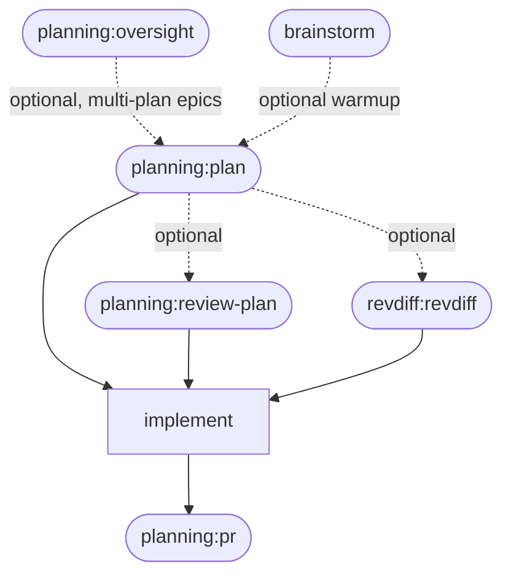

# Oversight Skill — Epic Scope, DoD, and Iteration Chunking

**Goal:** Add a new `oversight` skill that encodes the owner's recurring pre-planning phase — gather scope from tickets/an epic, pin down Definition of Done (INVEST-informed), decide whether the scope needs grouping into iterations, and persist all of it to a `docs/plans/wbs-<epic-slug>.md` doc — so this framework doesn't get re-derived from scratch at the start of every epic, the way it currently does with no skill of its own.

**Architecture:** A new `plugins/planning/skills/oversight/SKILL.md`, structured like the repo's other planning skills (numbered `## Step N` headers, `AskUserQuestion` JSON blocks) but shaped differently in one respect: it's meant to be revisited across an epic's whole lifetime rather than run once and exit, so its terminal state is a "Step 5: Iteration hub" loop (kick off an iteration / mark done / re-scope / done-for-now) instead of a report-and-stop. Persistence uses a new WBS-doc type in the existing `docs/plans/` directory, distinguished by a `wbs-` filename prefix rather than a separate directory. Because `review-plan`, `handoff`, and `pr` all do "most recently modified `.md` in `docs/plans/`" discovery when no explicit path is given, all three need a small fix to exclude `wbs-*.md` — otherwise touching a WBS doc's status makes it look like the most recent *implementation* plan to review or hand off. Moving to the next iteration delegates to the existing `planning:spawn-session` skill: `oversight` builds a self-contained task prompt (the iteration's tickets, its grouping rationale, and an instruction to run `/planning:plan` against that scope) and invokes `spawn-session` with it — `spawn-session` already owns the runtime/model questions and session creation, and the spawned session never needs to read the WBS doc itself since the prompt is already self-contained.

**Tech Stack:** Markdown (`SKILL.md` with YAML frontmatter and `AskUserQuestion` JSON blocks), no new scripts.

---

## Context (from discovery)

- `plugins/planning/skills/plan/SKILL.md` — writes new plan files, never does "pick the most recent existing plan" discovery (it only *checks for a sibling* at Step 0 as a deep-discovery-mode trigger, which already includes all of `docs/plans/` including `completed/` — a WBS doc matching the same feature would already correctly trigger deep-discovery mode there, since the existing bullet literally says "a WBS/parent doc"). **No fix needed here** — confirmed by re-reading the file fresh for this plan; earlier scoping notes assumed a fix was needed here and were wrong.
- `plugins/planning/skills/review-plan/SKILL.md:14` — `2. Otherwise check `docs/plans/` — most recently modified `.md` (excluding `completed/`)` — prose instruction, not a literal shell command. Needs `wbs-*.md` added to the exclusion.
- `plugins/planning/skills/handoff/SKILL.md:19-24` — same discovery, but as a literal command: `` Run: `ls -t docs/plans/*.md 2>/dev/null | head -1` `` with an explanatory parenthetical about why `completed/` is already excluded. Needs the command itself changed, plus the parenthetical updated to mention the new exclusion.
- `plugins/planning/skills/pr/SKILL.md:14-15` — two-step fallback: `docs/plans/completed/` first (no exclusion needed — WBS docs never live there), then `` `docs/plans/` — most recently modified `.md` file (excluding `completed/`) `` (needs the same `wbs-*.md` exclusion as `review-plan`). Found by re-grepping all three discovery call sites fresh for this plan — `pr` was not in the original scoping notes and would otherwise have been missed.
- `plugins/planning/skills/spawn-session/SKILL.md` — not modified, but now a direct dependency: `oversight`'s Step 5 "Kick off an iteration" invokes it (Skill tool) to actually spawn the next iteration's session, rather than being unrelated. `plugins/brainstorm/skills/brainstorm/SKILL.md` — unrelated, no plan-file discovery, no dependency either way. No changes to either file.
- `revdiff:revdiff`, referenced throughout this repo's docs, is **not** a plugin in this repo (`ls plugins/` confirms: `brainstorm`, `git-tools`, `global-rules`, `planning`, `statusline`, `style` — no `revdiff`). It's a separately-installed marketplace plugin, out of scope, referenced only as a cross-plugin pointer the same way other skills already do.
- `plugins/global-rules/agents/atlassian-caller.md` — exists and could fetch Jira epic data, but per the earlier decision to keep this plan focused, `oversight` does not integrate with it; the user pastes ticket lists/titles in manually. Recorded as a Post-Completion item, not built here.
- `plugins/planning/.claude-plugin/plugin.json` — version `1.21.1` (bumped twice already today by other work in this session — do not assume it's still `1.20.1` or `1.21.0`). Needs a minor bump for the new skill.
- `CHANGELOG.md` — newest-first; current top entry is `## planning 1.21.1 - 2026-09-15`. New entry goes above it.
- `README.md` — top-level pipeline Mermaid diagram (`BS`/`PL`/`RP`/`RD`/`IM`/`DPR` nodes), a skill table (`plan`/`review-plan`/`pr`/`handoff`/`spawn-session` rows), and per-skill flow diagrams for `plan` and `review-plan`. `oversight` needs a table row, a pipeline-diagram node (before `planning:plan`), and — given its flow has a resume/new branch, an INVEST/chunking sequence, and a hub loop, matching the complexity that earned `plan` and `review-plan` their own diagrams — its own flow diagram too.
- `tests/run.sh` — this repo's real test harness (`bash tests/run.sh`, wired into CI). Only tests `.sh` scripts; this plan adds none, so no test-harness change is needed. Confirmed nothing under `plugins/planning/scripts/` is touched by this plan.

## Development Approach

- **Testing approach**: Regular — there's no code here, only Markdown. No automated test exists for skill prompt files in this repo (confirmed: `tests/run.sh` only covers `.sh` scripts). Verify by reading each finished file back against the scenarios in "Technical Details" below: does Step 0 actually distinguish "no WBS docs" / "one" / "multiple"; does the iteration hub loop correctly return to itself after each branch; does `wbs-*.md` actually get excluded by the three fixed discovery call sites.
- complete each task fully before moving to the next
- make small, focused changes
- **CRITICAL: update this plan file when scope changes during implementation**
- **CRITICAL: single summary commit at the end** — no per-task commits; one commit covers all implementation + plan move when complete
- do not touch `plan/SKILL.md`, `spawn-session/SKILL.md`, or `brainstorm/SKILL.md` — confirmed above none of them need the discovery fix, and none of them reference `oversight` in a way that requires updating
- do not add Jira/Confluence integration or any new `.sh` script — both out of scope per the owner's own stated decisions; the iteration kickoff *does* spawn a session, via the existing `planning:spawn-session` skill (revised from an earlier no-spawning decision after the kickoff mechanism's concrete details came up in review) — that's reuse of an existing skill, not a new spawning mechanism of its own

## Technical Details

- **New doc type, `docs/plans/wbs-<epic-slug>.md`**: distinguished from per-iteration plans (`docs/plans/yyyy-mm-dd-<task-name>.md`) by the `wbs-` prefix instead of a leading date. `<epic-slug>` is kebab-case, derived from the epic name/ticket reference the user gives in Step 1.
- **Status vocabulary** (used consistently in the WBS template and the iteration hub): just two states, `not started` and `done` — collapsed from an originally-designed six-state machine (`not started`/`planning`/`planned`/`in review`/`implemented`/`done`) that assumed reliable manual bookkeeping across sessions the owner wasn't confident would actually happen. Every iteration starts at `not started`.
- **Resume detection**: `ls -t docs/plans/wbs-*.md 2>/dev/null` — zero results means new scope, one result means resume (unless `$ARGUMENTS` clearly names a different epic), multiple results means ask which one (mirroring `review-plan` Step 0's existing "list them and ask" pattern for plan-file ambiguity).
- **Discovery-exclusion fix, exact before/after for each of the three files:**

  | File | Before | After |
  |---|---|---|
  | `review-plan/SKILL.md:14` | `` 2. Otherwise check `docs/plans/` — most recently modified `.md` (excluding `completed/`) `` | `` 2. Otherwise check `docs/plans/` — most recently modified `.md` (excluding `completed/` and `wbs-*.md`) `` |
  | `handoff/SKILL.md:21` | `` Run: `ls -t docs/plans/*.md 2>/dev/null \| head -1` `` | `` Run: `ls -t docs/plans/*.md 2>/dev/null \| grep -v '/wbs-' \| head -1` `` |
  | `pr/SKILL.md:15` | `` 3. Otherwise check `docs/plans/` — most recently modified `.md` file (excluding `completed/`) `` | `` 3. Otherwise check `docs/plans/` — most recently modified `.md` file (excluding `completed/` and `wbs-*.md`) `` |

- **Kickoff mechanism**: `oversight` invokes `planning:spawn-session` (Skill tool) directly with a self-contained prompt built from the iteration's tickets and grouping rationale — it never produces a manual copy-paste line. An earlier draft of this plan had `oversight` print a line for the user to paste into a session they'd open manually; revised after review surfaced that pointing a new session at the whole WBS doc would make it read/reason over epic-wide state (other iterations, the full scope table) it doesn't need.
- **`oversight`'s Step 5 hub is intentionally a menu**, unlike the "what's next" menus removed from `plan`/`review-plan` earlier in this session. Those were removed because they were a stale, one-shot duplicate of directly-invocable skills (`review-plan`, `handoff`). This hub is different in kind: it's the core repeated interaction of a session explicitly meant to stay open and get revisited across an epic's lifetime — the same justification that kept `review-plan`'s Step 3 "Fix and re-review" loop when everything else got trimmed.

## Progress Tracking
- mark completed items with `[x]` immediately when done
- add newly discovered tasks with ➕ prefix
- document issues/blockers with ⚠️ prefix

## Implementation Steps

### Task 1: Create `oversight/SKILL.md`

**Files:**
- Create: `plugins/planning/skills/oversight/SKILL.md`

- [ ] **Write the file**:

```markdown
---
name: oversight
description: Establish scope, Definition of Done, and iteration chunking for a multi-plan epic, before any iteration gets individually planned. Activates on "let's scope this epic", "start an oversight session", "oversight session for X", "break this epic into iterations", "how should we chunk this epic", or when deciding how to group tickets into chunks of work before planning any of them.
argument-hint: "[epic or scope description]"
allowed-tools: Read, Write, Edit, Glob, Grep, Bash, Skill, AskUserQuestion
---

# Oversight: Scope, Definition of Done, and Iteration Chunking

A standing session for the whole duration of a multi-plan epic: establish
scope, pin down Definition of Done, decide how to chunk the scope into
iterations, and track iteration status in a persistent
`docs/plans/wbs-<slug>.md` doc — so restarting this session mid-epic resumes
from that doc instead of re-deriving the framework from scratch.

Not `plan` (which plans one iteration in detail once scope is already
decided) and not `brainstorm` (creative design dialogue for a single idea).
This is the layer above both: deciding *what* the iterations are before any
of them gets individually planned.

## Step 0: New scope or resume?

Find existing WBS docs: `ls -t docs/plans/wbs-*.md 2>/dev/null`.

- **No WBS docs found**: this is new scope. Go to Step 1.
- **One WBS doc found**: read it fully. If `$ARGUMENTS` was given and clearly
  names a *different* epic than this doc, treat the request as new scope (go
  to Step 1) instead of forcing it into an unrelated doc. Otherwise, this is
  a resume: go to Step 5 with the doc's current state.
- **Multiple WBS docs found**: if `$ARGUMENTS` narrows it to one (matches a
  slug or title), read that one and go to Step 5. Otherwise list each one
  (title + a one-line iteration-status summary) and ask which one, or
  "start a new epic."

## Step 1: Gather scope

Ask (one question at a time) what makes up this epic's scope: the
ticket/epic reference if there is one (a Jira key, an epic name, or just a
description), and a rough list of the individual tickets/tasks involved.
Free text is fine — this doesn't need a formal ticket system; a plain list
of "things that need to happen" works.

This skill does not integrate with Jira/Confluence directly — if the user
has a Jira epic, they paste the ticket list/titles in themselves rather than
this skill fetching them.

## Step 2: Decide chunking into iterations

Explain the grouping heuristic, then propose a grouping:

> Group tickets into one iteration when planning and implementing them
> one-by-one, in isolation, would produce throwaway work — stubs, fake or
> interim implementations that get discarded minutes later when the next
> ticket's real implementation replaces them. Otherwise, leave each ticket
> as its own iteration. Some scopes don't need grouping at all — either
> every ticket is already big enough to stand alone, or the initial
> decomposition is already good and each ticket is genuinely independent.

Propose a specific grouping (which tickets share an iteration, and why —
cite the actual dependency/stub-avoidance reason, not just "these seem
related"), or propose no grouping at all if none of the scope needs it. Go
to Step 3 to check the proposal against INVEST before asking for
confirmation — a grouping that fails INVEST needs adjusting before it's
worth confirming, not after.

## Step 3: INVEST pass on the proposed iterations

Check the grouping from Step 2 against INVEST, per iteration — not per raw
ticket. An iteration, not a single ticket, is the actual unit that gets
handed to `plan` and delivered, so it's what needs to satisfy INVEST; a
ticket can legitimately fail this alone precisely because it's meant to be
part of a group:

- **Independent** — can this iteration be delivered without waiting on
  another iteration in this scope?
- **Negotiable** — is it a rough contract, not an overspecified spec?
- **Valuable** — does it deliver something a user/stakeholder actually
  cares about on its own?
- **Estimable** — can its size be judged with reasonable confidence?
- **Small** — does it fit in a single `plan` invocation, not a mini-epic
  itself?
- **Testable** — is there a clear, checkable condition for "this iteration
  is done"?

Flag anything that fails a criterion and discuss it with the user — this
usually means adjusting the grouping (go back to Step 2), not accepting a
flawed iteration. Once every iteration holds up, ask for the epic-level
Definition of Done: one clear sentence describing what "the whole scope is
done" means. Then confirm the final grouping with AskUserQuestion before
writing anything down — this is a real decision, not a formality:

```json
{
  "questions": [{
    "question": "Proposed iteration grouping — does this look right?",
    "header": "Chunking",
    "options": [
      {"label": "Yes, use this grouping", "description": "Write the WBS doc with the iterations as proposed"},
      {"label": "No, let me adjust", "description": "Discuss changes before writing anything down"}
    ],
    "multiSelect": false
  }]
}
```

## Step 4: Write the WBS doc

Create `docs/plans/wbs-<epic-slug>.md` (slug from the epic name/ticket
reference, kebab-case):

```markdown
# WBS: [Epic Title]

**Scope source:** [ticket/epic reference, or "ad hoc — no ticket system"]
**Definition of Done (epic-level):** [one sentence]

---

## Scope

| Ticket | Title |
|--------|-------|
| [ID or n/a] | [title] |

## Chunking Decision

[the grouping rationale from Step 2, in full — which tickets are grouped and why, or why nothing is grouped]

## Iterations

### Iteration 1: [name]
**Tickets:** [ticket IDs/titles in this iteration]
**Status:** not started
**Grouping rationale:** [why these tickets are together, or "ungrouped — stands alone"]
**INVEST notes:** [anything flagged in Step 3, or "clean"]

### Iteration 2: [name]
**Tickets:** [...]
**Status:** not started
**Grouping rationale:** [...]
**INVEST notes:** [...]

## Progress Log
- [today's date]: WBS created. [N] iterations defined.
```

Two statuses only: `not started` and `done`. Every iteration starts at
`not started`.

## Step 5: Iteration hub

This is where every path lands — a fresh WBS doc from Step 4, or a resumed
one from Step 0. Show the current iteration list with status, then ask:

```json
{
  "questions": [{
    "question": "What would you like to do?",
    "header": "Next step",
    "options": [
      {"label": "Kick off an iteration", "description": "Spawn a new session to plan a specific iteration, via planning:spawn-session"},
      {"label": "Mark an iteration done", "description": "Update status once an iteration is actually finished"},
      {"label": "Add or re-scope tickets", "description": "Add new tickets to this epic, or revisit the chunking decision"},
      {"label": "Done for now", "description": "Stop here — this session stays available to resume later"}
    ],
    "multiSelect": false
  }]
}
```

- **Kick off an iteration**: ask which iteration — with only two statuses
  there's no "next" to infer, and the user typically already knows which
  one they mean ("let's start iteration 1", "the third part is done, kick
  off the next one"). Build a self-contained task prompt from what this
  doc already has: the iteration's tickets and its grouping rationale, plus
  an instruction to run `/planning:plan` against that scope. The new
  session doesn't need to read the WBS doc itself — everything it needs is
  already in the prompt, so it isn't pulled into reasoning about the rest
  of the epic (other iterations, the full scope table) for no reason:

  ```
  Plan [iteration name]: [tickets, comma-separated].

  [grouping rationale for this iteration, copied from the WBS doc's
  Iterations section — verbatim, so the new session knows why these
  tickets are bundled together]

  Run /planning:plan against this scope.
  ```

  Invoke the `planning:spawn-session` skill (Skill tool) with that prompt
  as its argument — it handles the rest itself: asking which CLI/runtime
  and model, naming and spawning the session. This skill doesn't ask those
  questions; `spawn-session` already does. Append a Progress Log entry
  noting the iteration was kicked off (date + iteration name) — status
  stays `not started` until the user reports it done. Go back to Step 5
  once `spawn-session` reports the outcome.

- **Mark an iteration done**: ask which iteration, update its status to
  `done` in the WBS doc and append a Progress Log entry (date + what
  changed). Go back to Step 5.

- **Add or re-scope tickets**: run Step 1 for the new tickets, then re-run
  Step 2/Step 3's chunking and INVEST pass — new tickets might join an
  existing iteration or form a new one; iterations already `done` should
  not be silently reshuffled without telling the user. Update the WBS doc
  (Scope table, Chunking Decision, Iterations), append a Progress Log
  entry, go back to Step 5.

- **Done for now**: stop. The WBS doc is already saved — the next time this
  skill runs against the same epic, it resumes from here (Step 0).

## Key principles

- **One question at a time** — do not overwhelm with multiple questions
- **This session is long-lived** — unlike `plan`/`review-plan`, which report
  and stop, oversight's whole job is the Step 5 hub: it's meant to be
  revisited across the epic's lifetime, in this session or a resumed one
- **Persist, don't re-derive** — every decision (scope, DoD, chunking,
  status) lives in the WBS doc, not just this conversation's memory
- **Delegate spawning, don't reimplement it** — kicking off an iteration
  goes through `planning:spawn-session`, which already owns the
  runtime/model questions and session creation; this skill only builds the
  task prompt
- **Chunk only to avoid throwaway work** — grouping tickets into one
  iteration is justified by "isolated planning would produce stubs
  discarded minutes later," never by vague relatedness
- **Context economy** — this session's context is often rebuilt from
  scratch after long (1h+) gaps between tasks. Keep step text and prompts
  minimal; don't load or write anything "just in case"
```

- [ ] **Verify the frontmatter is well-formed and consistent with sibling skills**

  Run: `grep -n "^name:\|^description:\|^argument-hint:\|^allowed-tools:" plugins/planning/skills/oversight/SKILL.md plugins/planning/skills/spawn-session/SKILL.md`
  Expected: both have `name`/`description`/`argument-hint`/`allowed-tools` in the same order, and neither sets `disable-model-invocation`. The `allowed-tools` *values* will differ — `oversight` includes `Skill` (it invokes `spawn-session`), `spawn-session` doesn't need `Skill` itself — that's expected, not a mismatch to fix.

### Task 2: Fix `docs/plans/*.md` discovery to exclude `wbs-*.md`

**Files:**
- Modify: `plugins/planning/skills/review-plan/SKILL.md`
- Modify: `plugins/planning/skills/handoff/SKILL.md`
- Modify: `plugins/planning/skills/pr/SKILL.md`

- [ ] **`review-plan/SKILL.md`** — change line 14 from:

```
2. Otherwise check `docs/plans/` — most recently modified `.md` (excluding `completed/`)
```

  to:

```
2. Otherwise check `docs/plans/` — most recently modified `.md` (excluding `completed/` and `wbs-*.md`)
```

- [ ] **`handoff/SKILL.md`** — change lines 19-24 from:

```markdown
2. Otherwise, find the most recently modified plan:

   Run: `ls -t docs/plans/*.md 2>/dev/null | head -1`

   (this already excludes `docs/plans/completed/`, since `*.md` only globs
   files directly under `docs/plans/`, not its subdirectories)
```

  to:

```markdown
2. Otherwise, find the most recently modified plan:

   Run: `ls -t docs/plans/*.md 2>/dev/null | grep -v '/wbs-' | head -1`

   (this already excludes `docs/plans/completed/`, since `*.md` only globs
   files directly under `docs/plans/`, not its subdirectories; `grep -v`
   also excludes `docs/plans/wbs-*.md` epic-scope docs, which aren't
   per-iteration implementation plans)
```

- [ ] **`pr/SKILL.md`** — change line 15 from:

```
3. Otherwise check `docs/plans/` — most recently modified `.md` file (excluding `completed/`)
```

  to:

```
3. Otherwise check `docs/plans/` — most recently modified `.md` file (excluding `completed/` and `wbs-*.md`)
```

- [ ] **Verify the fix actually excludes a WBS file**, using the real dummy fixture plan already in the repo as a stand-in (create a throwaway WBS file alongside it, run the fixed command, then delete the throwaway file):

  Run:
  ```bash
  touch docs/plans/wbs-test-exclusion-check.md
  ls -t docs/plans/*.md 2>/dev/null | grep -v '/wbs-' | head -1
  rm docs/plans/wbs-test-exclusion-check.md
  ```
  Expected: the printed path is NOT `docs/plans/wbs-test-exclusion-check.md` — it's whichever real, non-`wbs-`-prefixed `.md` file in `docs/plans/` was actually most recently modified.

### Task 3: README.md — table row, pipeline diagram, oversight flow diagram

**Files:**
- Modify: `README.md`

- [ ] **Add an `oversight` row to the planning skill table**, inserted directly above the `plan` row (it's the step before `plan` in the pipeline):

```markdown
| `oversight` | Establish and track scope for a multi-plan epic before any of its iterations get individually planned — gathers tickets/tasks, proposes grouping them into iterations (only when planning tickets one-by-one would produce throwaway stubs later discarded by a grouped ticket's real implementation), then checks each proposed iteration against INVEST (Independent/Negotiable/Valuable/Estimable/Small/Testable) and pins down an epic-level Definition of Done. Persists to `docs/plans/wbs-<epic-slug>.md` — a distinct doc type from per-iteration plans, excluded from `review-plan`/`handoff`/`pr`'s "most recent plan" discovery so it's never picked up as one. Unlike `plan`/`review-plan`, this is meant to be revisited across the epic's lifetime: its iteration hub lets you kick off an iteration (spawns a new session via `planning:spawn-session`, passing a self-contained prompt built from that iteration's tickets and grouping rationale), mark an iteration done, or add/re-scope tickets, and resumes from the WBS doc if the session restarts mid-epic. |
```

- [ ] **Update the top-level pipeline Mermaid diagram**, adding an `oversight` node feeding into `planning:plan`:



- [ ] **Add an `oversight` — flow diagram**, inserted before the existing `**`plan` — flow**` section:

```markdown
**`oversight` — flow**

​```mermaid
flowchart TD
    A["find existing WBS docs"] --> B{"resume or new?"}
    B -->|"existing doc"| H
    B -->|"new epic"| C["gather scope: tickets/tasks"]
    C --> D["propose iteration chunking"]
    D --> E["INVEST pass per proposed iteration"]
    E -->|"fails INVEST"| D
    E -->|"holds up"| F["confirm grouping + epic DoD"]
    F --> G["write docs/plans/wbs-<epic>.md"]
    G --> H{"iteration hub"}
    H -->|"kick off iteration"| K(["build prompt from tickets + rationale, spawn via planning:spawn-session"])
    K --> H
    H -->|"mark done"| U["update WBS doc + progress log"]
    U --> H
    H -->|"add/re-scope tickets"| C
    H -->|"done for now"| STOP(["stop — resumable later"])
​```
```

  (write the actual triple-backtick fences, not the escaped `​``` ` shown above — those are escaped here only so this plan's own code block doesn't terminate early)

### Task 4: Version bump + CHANGELOG

**Files:**
- Modify: `plugins/planning/.claude-plugin/plugin.json`
- Modify: `CHANGELOG.md`

- [ ] **Bump `plugins/planning/.claude-plugin/plugin.json`** version from `1.21.1` to `1.22.0` (minor — new skill, new capability):

```json
  "version": "1.22.0",
```

- [ ] **Add a `CHANGELOG.md` entry** at the very top of the file (above the current `## planning 1.21.1 - 2026-09-15` section):

```markdown
## planning 1.22.0 - 2026-09-15

Adds `oversight`, a new skill for the epic-scoping phase before any
individual iteration gets planned — the owner's "Over" session, which
previously had no skill and got re-derived from scratch at the start of
every epic. Gathers scope, proposes grouping tickets into iterations only
when planning them one-by-one would produce throwaway stubs discarded
minutes later by a grouped ticket's real implementation, then checks each
proposed iteration against INVEST (not the raw tickets — a ticket can
legitimately fail INVEST alone precisely because it's meant to be
grouped), and pins down an epic-level Definition of Done. Persists to a
new doc type, `docs/plans/wbs-<epic-slug>.md`, distinct from per-iteration
plans — `review-plan`, `handoff`, and `pr`'s "most recent plan" discovery
now all exclude `wbs-*.md` so an epic-scope doc never gets picked up as an
implementation plan to review or hand off. Unlike `plan`/`review-plan`
(which report and stop), `oversight` is meant to be revisited across an
epic's lifetime: its iteration hub can kick off an iteration — which
spawns a new session via the existing `planning:spawn-session` skill,
passing a self-contained prompt (tickets + grouping rationale) so the new
session never has to read the WBS doc itself — mark an iteration done, or
add/re-scope tickets, and resumes from the WBS doc if the session
restarts mid-epic instead of re-deriving everything. Status tracking is
deliberately just two states (`not started`/`done`), not a finer-grained
machine, since nobody would reliably remember to update intermediate
states by hand.
```

### Task 5: Verify acceptance criteria, wrap up, commit

- [ ] Verify all requirements from the Goal are implemented:
  - `plugins/planning/skills/oversight/SKILL.md` exists, covers resume/new, INVEST pass, chunking decision, WBS doc write, and the iteration hub loop
  - `review-plan/SKILL.md`, `handoff/SKILL.md`, `pr/SKILL.md` all exclude `wbs-*.md` from their "most recent plan" discovery
  - README's table, pipeline diagram, and new `oversight` flow diagram all reflect the skill's actual behavior
  - `plugins/planning/.claude-plugin/plugin.json` is `1.22.0`, `CHANGELOG.md` has the matching entry
- [ ] Grep for any leftover reference to the corrected earlier scoping mistake (that `plan/SKILL.md` needed a fix):

  Run: `git diff --stat plugins/planning/skills/plan/SKILL.md`
  Expected: no output (file untouched) — confirms Task 2's correction (dropping the originally-assumed `plan/SKILL.md` fix) actually held
- [ ] `git status` / `git diff` review: confirm no stray files are staged (in particular, confirm the throwaway `docs/plans/wbs-test-exclusion-check.md` from Task 2's verification step was actually deleted and isn't showing up in `git status`)
- [ ] Before the final commit, check whether `main` is behind its remote tracking branch (`git fetch` then `git status`) and resync if needed (`git pull --rebase`)
- [ ] Move this plan to `docs/plans/completed/`: `mkdir -p docs/plans/completed && mv docs/plans/2026-09-15-oversight-skill.md docs/plans/completed/`
- [ ] **Show the full diff (`git diff` / `git diff --staged` after staging) and wait for explicit go-ahead before committing** — do not run the commit in the same step as staging; this is a hold point, not a formality
- [ ] Single summary commit: all implementation changes + plan move in one commit, only after that go-ahead. Do **not** push — leave the commit local for review.

## Post-Completion
*Items requiring manual intervention or external systems*

- **Jira/Confluence integration was explicitly deferred.** `oversight` could fetch epic/ticket data via the `atlassian-caller` subagent (`plugins/global-rules/agents/atlassian-caller.md`) instead of the user pasting ticket lists in manually — not built here, to keep this plan focused. Worth revisiting once the manual-paste flow has been used a few times and it's clear what's actually tedious about it.
- **Status vocabulary was deliberately kept minimal** (`not started`/`done` only) rather than modeling every real-world state (planned/in review/implemented) — per the owner's explicit call not to overthink it before real usage. Revisit if two states prove too coarse once the skill has actually been used across a few epics.
- **The kickoff prompt built for `spawn-session` is fully self-contained** — tickets + grouping rationale, no WBS-doc path included. If a spawned session ever needs epic-wide context beyond its own iteration (e.g. a cross-iteration dependency that only shows up in the full Scope table), it currently has no way to get it without the user pasting it in manually. Worth revisiting if that turns out to matter in practice.
