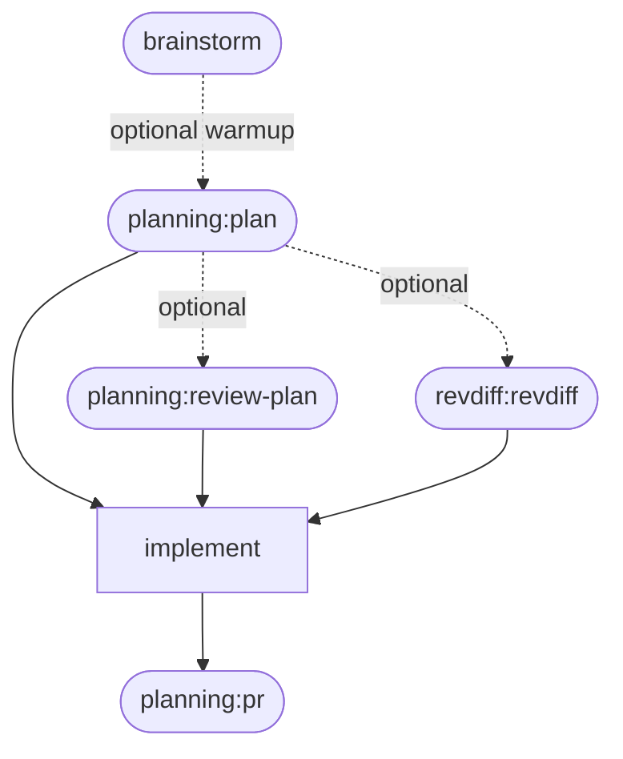
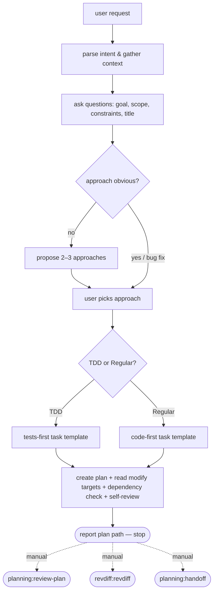
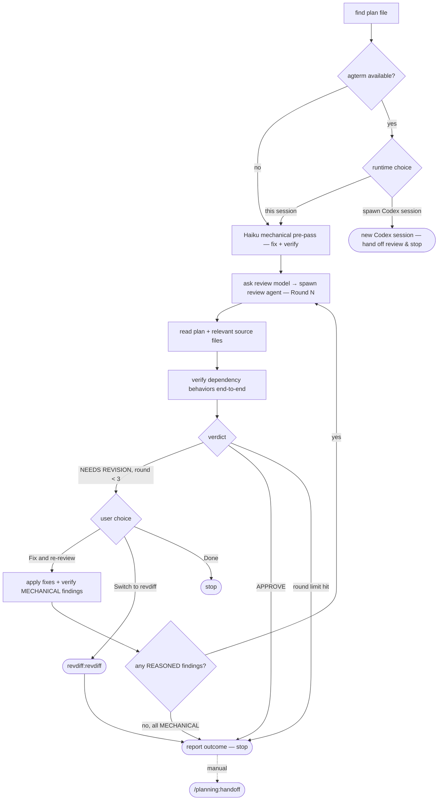

# review-plan Codex Hand-off and End-of-Skill Menu Cleanup

**Goal:** Let `review-plan` hand the whole review off to a freshly spawned Codex CLI session running the same skill there (instead of always reviewing in the current session), and remove the two stale end-of-skill "what's next" menus (`plan` Step 3, `review-plan` Step 5) now that `handoff`, `review-plan`, and `revdiff:revdiff` are all directly invocable on their own.

**Architecture:** `review-plan/SKILL.md` gains a new early step, "Choose review runtime," asking `AskUserQuestion` whether to review in this session (unchanged mechanics) or spawn a Codex session — modeled on `handoff`'s Claude/Codex runtime split, but with no model choice (owner's call: Codex-run reviews always use whatever model Codex is configured to use by default). The spawn path reuses the existing `codex-spawn.sh` primitive through a new thin wrapper, `codex-review-handoff.sh`, mirroring `codex-handoff.sh` but built around a review prompt instead of an implementation prompt; both canned prompts live together in the existing `handoff-prompt.sh`. Separately, `plan` Step 3 and `review-plan` Step 5 — both five-option "what's next" `AskUserQuestion` menus — are deleted and replaced with a one-line report-and-stop, since every option they offered (`review-plan`, `revdiff:revdiff`, `handoff`) is now a skill the user calls directly, and the menus' "Implement in a Subagent"/"Implement in a Separate Session" options were the *only* place `plan`/`review-plan` offered implementation hand-off — removing them means that capability now lives solely in `handoff`/`spawn-session`, not in `plan`/`review-plan` at all. README's three mermaid diagrams and skill-table prose are updated to match.

**Tech Stack:** Bash (`set -euo pipefail`), `agtermctl`/`jq` (agterm control CLI), the `codex` CLI, `tests/run.sh` bash test harness with a faked `agtermctl` on `PATH`, Markdown skill files (`SKILL.md`) with `AskUserQuestion` JSON blocks.

---

## Context (from discovery)

- `plugins/planning/skills/review-plan/SKILL.md` — Step 0 finds the plan file; Step 0.5 runs a Haiku mechanical pre-pass unconditionally (with a stale "skip if re-entering from Step 5's Run auto-review" clause that no longer has anywhere to point once Step 5's menu is removed); Step 1 asks which model reviews each round and spawns `plan-review`; Step 2 prints the report; Step 3 branches on verdict (Fix and re-review / Switch to revdiff / Done, or straight to Step 5 on APPROVE); Step 4 is the 3-round limit; Step 5 is the five-option post-review menu (Run auto-review / Review with revdiff / Implement in a Subagent / Implement in a Separate Session / Done) — the one being deleted.
- `plugins/planning/skills/plan/SKILL.md` — Step 3 is a near-identical five-option menu (Auto-review / Review with revdiff / Implement in a Subagent / Implement in a Separate Session / Done) after plan creation — the other one being deleted.
- `plugins/planning/skills/handoff/SKILL.md` — explicit-invocation-only skill that already hands a plan straight to a fresh agterm session running Claude or Codex, asking runtime then model. Its own framing ("the same mechanism `plan` and `review-plan` offer inline, without going through either skill's menus") goes stale once those menus no longer exist.
- `plugins/planning/scripts/codex-handoff.sh` — thin wrapper: builds the canned **implementation** hand-off prompt (`build_handoff_prompt`, from `handoff-prompt.sh`) into a temp file, sets `CODEX_FLAGS="--sandbox workspace-write --ask-for-approval never"` (+ `--model` if given), calls `codex-spawn.sh`. Session name `"Implement: $SLUG"`.
- `plugins/planning/scripts/codex-spawn.sh` — the agent-agnostic-prompt-file spawner: creates+flags a session via `agterm-session-new.sh`, types `codex [flags] "$(cat prompt-file)"`. Signature: `<cwd> <session-name> <prompt-file> [workspace-name] [codex-flags]`. Never modified by this plan — reused as-is.
- `plugins/planning/scripts/handoff-prompt.sh` — sourced (not executed), currently defines one function, `build_handoff_prompt(plan_file)`, used by both `agterm-handoff.sh` and `codex-handoff.sh` so the wording can't drift.
- `tests/run.sh` — this repo's actual test suite (run in CI via `.github/workflows/test.yml`: `bash tests/run.sh`). Has a shared fake `agtermctl` (logs invocations to `AGTERMCTL_LOG`, captures `--stdin` typed text to `AGTERMCTL_TYPED`, returns a canned `session new` JSON id) and a dedicated section per script, including one for `codex-handoff.sh` (lines 379-426) that this plan's new script's test section mirrors closely.
- `README.md` — a skill table (rows for `plan`, `review-plan`, `handoff`, `spawn-session`), one paragraph documenting the shared agterm-hand-off model/permission-mode behavior, three Mermaid diagrams (top-level pipeline, `plan — flow`, `review-plan — flow`), and one more mention of `review-plan`'s post-review menu (line 194, the `global-rules` install-hook explanation) used only as an illustrative example.
- `plugins/global-rules/scripts/setup.sh:31` — a code comment, `# Ensure AskUserQuestion dialogs (e.g. review-plan's post-review menu) don't`, in a *different* plugin (`global-rules`), goes stale for the same reason.
- `plugins/planning/.claude-plugin/plugin.json` — version `1.20.1`, needs a minor bump (new capability — the Codex review runtime — plus removed capability, not a pure fix).
- `plugins/global-rules/.claude-plugin/plugin.json` — version `1.6.1`, needs a patch bump (comment-only fix in a bundled script).
- `CHANGELOG.md` — newest-first, one `## <plugin> X.Y.Z - YYYY-MM-DD` section per bump. Historical entries (several already mention "post-review menu" / "Run auto-review") are a log, not living documentation — **do not edit them**, only add new sections.
- Confirmed via grep across `*.md`/`*.sh` (excluding `docs/plans/completed/` and `CHANGELOG.md`): the only *living* references to the menus/behaviors being removed are the six files listed above; `plugins/brainstorm/skills/brainstorm/SKILL.md`'s own "What's next?" menu is a different plugin/skill and is out of scope.

## Verified Dependency Behaviors

- `codex-spawn.sh <cwd> <session-name> <prompt-file> [workspace-name] [codex-flags]` (`plugins/planning/scripts/codex-spawn.sh`): on success, creates+flags an agterm session via `agterm-session-new.sh`, types `codex <codex-flags> "$(cat <prompt-file>)"` followed by a newline, and prints `<session-name>` to stdout — never the prompt text itself on the command line. Requires `AGTERM_ENABLED=1` and `agtermctl` on `PATH`; exits 1 with a one-line stderr reason otherwise, or if `<prompt-file>` doesn't exist. `codex-review-handoff.sh` (new, this plan) calls it exactly the same way `codex-handoff.sh` already does, just with a different prompt and no `--model`.
- `build_handoff_prompt(plan_file)` (`plugins/planning/scripts/handoff-prompt.sh`): a shell function, sourced not executed, that `cat <<EOF`s a canned prompt referencing `$plan_file` and returns via stdout when called as `build_handoff_prompt "$PLAN_FILE" > "$PROMPT_FILE"`. Adding a second function, `build_review_prompt`, to the same file follows the exact pattern already established and does not affect `build_handoff_prompt` or its two existing callers.
- `agtermctl session type --stdin --target <id>` fed via `printf '...' | agtermctl session type --stdin ...` (used identically inside `codex-spawn.sh`): the prompt text itself is never placed on the typed command line — only the prompt-file path is typed, and the new session's own shell does `$(cat ...)` at run time. Unaffected by this plan; `codex-review-handoff.sh` relies on this via `codex-spawn.sh`, same as `codex-handoff.sh` does.
- Test fake `agtermctl` (`tests/run.sh`, "Shared fake agtermctl" section, already built before the `planning/codex-handoff.sh` section runs): logs every invocation to `AGTERMCTL_LOG`, captures `--stdin` input to `AGTERMCTL_TYPED`, returns `AGTERMCTL_SESSION_NEW_JSON` (default `{"result":{"id":"fake-session-id"}}`) for `session new`. The new `planning/codex-review-handoff.sh` test section reuses the same `$AGTERM_FAKE_BIN` built earlier in the file — no new fake needed.

## Development Approach

- **Testing approach**: Regular (code first, then tests) for the script change — matches how `codex-handoff.sh`'s own tests were written. The `SKILL.md`/`README.md`/comment changes have no automated test; verify those by reading the finished file back against the scenarios in "Technical Details" below (does Step 0.3 correctly gate on agterm availability, does Step 5 correctly cover all three arrival paths, does every diagram edge match the prose it illustrates).
- complete each task fully before moving to the next
- make small, focused changes
- **CRITICAL: `codex-review-handoff.sh` MUST get a `tests/run.sh` section**, mirroring the existing `codex-handoff.sh` section
- **CRITICAL: all tests (`bash tests/run.sh`) must pass before starting next task**
- **CRITICAL: update this plan file when scope changes during implementation**
- **CRITICAL: single summary commit at the end** — no per-task commits; one commit covers all implementation + plan move when complete
- run `bash tests/run.sh` after each script/test-file change
- do not touch `agterm-handoff.sh`, `codex-handoff.sh`, `codex-spawn.sh`, or `agterm-session-new.sh` — all four are reused exactly as-is
- do not edit any existing `CHANGELOG.md` section — only append new ones

## Technical Details

- **New script signature**: `codex-review-handoff.sh <plan-file>` — deliberately **no** `[model]` parameter (unlike `codex-handoff.sh`), per the owner's explicit call: Codex-run reviews always use whatever model Codex is configured to use by default, with no per-review model question. Session name prefix `"Review: $SLUG"` (vs. `codex-handoff.sh`'s `"Implement: $SLUG"`), so a review hand-off and an implementation hand-off for the same plan are distinguishable in the agterm sidebar.
- **`review-plan/SKILL.md` step renumbering**: insert a new `## Step 0.3: Choose review runtime` between the existing `## Step 0: Find the plan file` and `## Step 0.5: Mechanical pre-pass`. No other step numbers change — Step 0.5 through Step 4's internal "go to Step 5" references stay textually valid, since Step 5 continues to exist under the same heading with new (terminal) content.
- **Step 0.3 gating**: reuses the exact same availability check already used to gate Step 5's "Implement in a Separate Session" option: `[ "$AGTERM_ENABLED" = "1" ] && command -v agtermctl >/dev/null 2>&1`. If unavailable, skip the question entirely (there'd only be one real option, and `AskUserQuestion` requires ≥2) and continue straight to Step 0.5, exactly matching the pattern already used elsewhere in this file for optional agterm-gated options.
- **Step 0.5 stale clause removal**: the sentence `Skip this step only when re-entering the loop from Step 5's "Run auto-review" — it has already run for this plan.` is removed outright. It described re-entering the pre-pass from the old Step 5 menu's "Run auto-review" option; that option no longer exists (Step 5 is now a terminal report-and-stop, never looped back into), so there is no re-entry path left to describe. Step 0.5 now unconditionally runs once per invocation, immediately after Step 0.3 resolves to "This session."
- **Step 1's existing model question is unaffected.** The owner explicitly decided the existing Inherit/Opus/Sonnet/Haiku `AskUserQuestion` in Step 1 needs no Codex-specific handling — "Inherit" already covers "let Codex use its own default," which is what actually happens when a Codex session (spawned by Step 0.3, or a Codex session where the user just typed `/planning:review-plan` directly) reaches its own Step 1.
- **Step 5 replaces a 5-option menu with a report-and-stop covering 3 arrival paths**: APPROVE verdict (Step 3), round limit hit (Step 4, which already prints "Review limit reached... remaining issues listed above" — Step 5 must not repeat that), and a revdiff pass returning (Step 3's "Switch to revdiff" branch). No `AskUserQuestion` call remains in Step 5.
- **`plan/SKILL.md` Step 3 replacement**: same treatment — the whole `AskUserQuestion` block and its five branches are deleted, replaced with a one-line report ("created plan: ...") and a stop, matching the template phrasing already used by `handoff/SKILL.md`'s reporting steps.
- **`handoff/SKILL.md` wording**: its frontmatter `description` and opening paragraph both currently justify the skill's existence as "skipping the plan/review-plan menus." Since those menus no longer exist, `handoff` is no longer *skipping* anything — it's the only route left. Reworded to state that plainly instead of referencing a removed mechanism.
- **README updates, six spots**, detailed per-file below in Task 5.
- **`plugins/global-rules/scripts/setup.sh:31` comment**: `review-plan's post-review menu` → `review-plan's runtime/model-choice prompts` (the example just needs to name something that still exists and still uses `AskUserQuestion`).

## Progress Tracking
- mark completed items with `[x]` immediately when done
- add newly discovered tasks with ➕ prefix
- document issues/blockers with ⚠️ prefix

## Implementation Steps

### Task 1: `codex-review-handoff.sh` + shared review prompt + tests

**Files:**
- Create: `plugins/planning/scripts/codex-review-handoff.sh`
- Modify: `plugins/planning/scripts/handoff-prompt.sh`
- Modify: `tests/run.sh`

- [ ] **Add `build_review_prompt` to `handoff-prompt.sh`**, and update its header comment to describe both builders it now holds:

```bash
#!/usr/bin/env bash
# Shared canned prompt text for a plan-file hand-off. Sourced (not executed)
# by agterm-handoff.sh and codex-handoff.sh (implementation hand-off, via
# build_handoff_prompt) and by codex-review-handoff.sh (review hand-off, via
# build_review_prompt), so the wording for each can only be defined once and
# can't drift between call sites.

build_handoff_prompt() {
  local plan_file="$1"
  cat <<EOF
You have a new implementation plan to execute: $plan_file

Read it fully, then implement every task in order, following its stated
testing approach. Run the project's tests and linter before treating any
task as done.
EOF
}

build_review_prompt() {
  local plan_file="$1"
  cat <<EOF
You have a new implementation plan to review: $plan_file

Review it thoroughly — check correctness, over-engineering, and test
coverage, apply fixes, and iterate review rounds as needed until it's ready
for implementation or a round limit is reached.
EOF
}
```

- [ ] **Create `codex-review-handoff.sh`**:

```bash
#!/usr/bin/env bash
# Hand off a plan REVIEW (not implementation) to a fresh agterm session
# running `codex`. Companion to codex-handoff.sh, which hands off plan
# implementation instead — this one is invoked from review-plan/SKILL.md's
# Step 0.3 runtime choice, not from `handoff`. No model parameter: the
# reviewing session always uses whatever model Codex is configured to use
# by default, since there's no way to surface Claude-style model tiers to a
# Codex-run review anyway.
#
# Usage: codex-review-handoff.sh <plan-file>
# Requires: AGTERM_ENABLED=1, agtermctl and jq on PATH.
# On success: prints the new session's display name (e.g. "Review: foo")
# to stdout, exits 0.
# On failure: prints a one-line reason to stderr, exits 1.

set -euo pipefail

PLAN_FILE="${1:?usage: codex-review-handoff.sh <plan-file>}"

if [ "${AGTERM_ENABLED:-}" != "1" ] || ! command -v agtermctl >/dev/null 2>&1; then
  echo "codex-review-handoff: not available — AGTERM_ENABLED is unset or agtermctl wasn't found on PATH" >&2
  exit 1
fi

PROJECT_ROOT=$(git rev-parse --show-toplevel)
SLUG=$(basename "$PLAN_FILE" .md | sed -E 's/^[0-9]{4}-[0-9]{2}-[0-9]{2}-//')
SESSION_NAME="Review: $SLUG"

SCRIPT_DIR=$(cd "$(dirname "${BASH_SOURCE[0]}")" && pwd)
source "$SCRIPT_DIR/handoff-prompt.sh"

PROMPT_FILE=$(mktemp "${TMPDIR:-/tmp}/codex-review-handoff.XXXXXX")
build_review_prompt "$PLAN_FILE" > "$PROMPT_FILE"

# Workspace-write is needed even though the plan-review subagent itself is
# read-only: the fix-and-re-review loop that runs between rounds edits the
# plan file directly.
CODEX_FLAGS="--sandbox workspace-write --ask-for-approval never"

bash "$SCRIPT_DIR/codex-spawn.sh" "$PROJECT_ROOT" "$SESSION_NAME" "$PROMPT_FILE" "" "$CODEX_FLAGS"
```

- [ ] **Add a `planning/codex-review-handoff.sh` test section to `tests/run.sh`**, inserted between the existing `rm -rf "$CODEX_TEST_REPO"` line and the final `rm -rf "$AGTERM_FAKE_BIN" "$TEST_REPO"` cleanup line (i.e. right after the `planning/codex-handoff.sh` section, still before the closing `# ---` / Results block):

```bash
# ---------------------------------------------------------------------------
# planning/codex-review-handoff.sh
# ---------------------------------------------------------------------------

CODEX_REVIEW_HANDOFF_SCRIPT="${REPO_ROOT}/plugins/planning/scripts/codex-review-handoff.sh"

echo "planning/codex-review-handoff.sh"

CODEX_REVIEW_TEST_REPO="$(mktemp -d)"
(cd "$CODEX_REVIEW_TEST_REPO" && git init -q)
CODEX_REVIEW_PLAN_FILE="${CODEX_REVIEW_TEST_REPO}/docs/plans/2026-01-01-example.md"
mkdir -p "$(dirname "$CODEX_REVIEW_PLAN_FILE")"
echo "# Example plan" > "$CODEX_REVIEW_PLAN_FILE"

LOG="$(mktemp)"
TYPED="$(mktemp)"
result=$(
  cd "$CODEX_REVIEW_TEST_REPO" && \
  AGTERMCTL_LOG="$LOG" AGTERMCTL_TYPED="$TYPED" AGTERM_ENABLED="1" AGTERM_WORKSPACE_ID="ws-1" \
  PATH="${AGTERM_FAKE_BIN}:${PATH}" bash "$CODEX_REVIEW_HANDOFF_SCRIPT" "$CODEX_REVIEW_PLAN_FILE"
)
assert_eq "prints the new session's display name on success" "Review: example" "$result"
assert_contains "flags the new session" "session flag on --target fake-session-id" "$(cat "$LOG")"
assert_contains "creates the session before flagging" "session new" "$(cat "$LOG")"
TYPED_CMD="$(cat "$TYPED")"
assert_contains "types a codex launch command with workspace-write flags" 'codex --sandbox workspace-write --ask-for-approval never "$(cat ' "$TYPED_CMD"
assert_not_contains "never passes a --model flag" "--model" "$TYPED_CMD"
PROMPT_PATH="${TYPED_CMD#*cat }"
PROMPT_PATH="${PROMPT_PATH%)\"}"
assert_eq "the prompt file the typed command reads actually exists" "yes" "$([ -f "$PROMPT_PATH" ] && echo yes || echo no)"
PROMPT_CONTENT="$(cat "$PROMPT_PATH" 2>/dev/null || echo "")"
assert_contains "prompt file references the plan path" "$CODEX_REVIEW_PLAN_FILE" "$PROMPT_CONTENT"
assert_contains "prompt file tells the session to review it thoroughly" "Review it thoroughly" "$PROMPT_CONTENT"
rm -f "$LOG" "$TYPED"

result=$(AGTERM_ENABLED="" bash "$CODEX_REVIEW_HANDOFF_SCRIPT" "$CODEX_REVIEW_PLAN_FILE" 2>&1; echo "exit:$?")
assert_contains "refuses to run when AGTERM_ENABLED is unset" "exit:1" "$result"

rm -rf "$CODEX_REVIEW_TEST_REPO"

```

- [ ] **Run tests to verify all pass**

  Run: `bash tests/run.sh`
  Expected: PASS — new `planning/codex-review-handoff.sh` assertions pass; `planning/codex-handoff.sh` and every other existing section still passes unmodified.

### Task 2: `review-plan/SKILL.md` — runtime choice + terminal step

**Files:**
- Modify: `plugins/planning/skills/review-plan/SKILL.md`

- [ ] **Insert a new `## Step 0.3: Choose review runtime`** between the current `## Step 0: Find the plan file` (ends after its 3-item list) and `## Step 0.5: Mechanical pre-pass`:

```markdown
## Step 0.3: Choose review runtime

Before running any review round, check availability: `[ "$AGTERM_ENABLED" = "1" ] && command -v agtermctl >/dev/null 2>&1`. If unavailable, skip this step entirely and continue to Step 0.5 — there's only one real choice (this session), so there's nothing to ask.

If available, ask with AskUserQuestion:

```json
{
  "questions": [{
    "question": "Where should this review run?",
    "header": "Runtime",
    "options": [
      {"label": "This session", "description": "Continue here — delegates each review round to the plan-review subagent, as it already does"},
      {"label": "Spawn Codex session", "description": "Hand the whole review off to a freshly spawned Codex CLI session running this same skill there — this session's job ends once it's spawned"}
    ],
    "multiSelect": false
  }]
}
```

**This session**: continue to Step 0.5.

**Spawn Codex session**: run `bash "${CLAUDE_PLUGIN_ROOT}/scripts/codex-review-handoff.sh" "PLAN_FILE"` (substitute the real plan path for `PLAN_FILE`). No model question — the spawned session always uses whatever model Codex is configured to use by default.

On success (exit 0), the script's last stdout line is the new session's display name (e.g. `Review: foo`) — tell the user the review has been handed off to a new Codex session with that name, in this same workspace, and they can switch to it to watch or drive it directly. On failure (non-zero exit), tell the user the hand-off failed, quoting the script's stderr output. Do not fall back to reviewing in this session silently. Either way, stop completely — do NOT run Step 0.5 or any review round in this session.
```

- [ ] **Edit Step 0.5** — remove the now-stale skip clause. Delete this sentence entirely (it references the old Step 5 "Run auto-review" option, which no longer exists after Task 3):

```
Skip this step only when re-entering the loop from Step 5's "Run auto-review" — it has already run for this plan.
```

  Step 0.5 now runs unconditionally, every time this skill reaches it.

- [ ] **Replace `## Step 5: Post-review menu` in full** (the entire section, from its heading through the final `- **Done**: stop completely — do NOT suggest or begin implementation` line) with:

```markdown
## Step 5: Report and stop

This is where every review path ends — auto-review approval, round limit, or a revdiff pass finishing. Report the outcome and stop. Do not ask what to do next — the user calls `/planning:handoff`, `revdiff:revdiff`, or begins implementation directly when ready.

- **Arriving with an APPROVE verdict** (Step 3): tell the user the plan is approved and ready for implementation.
- **Arriving after the round limit** (Step 4, which already reported "Review limit reached (3 rounds). Remaining issues listed above."): nothing further to report — just stop.
- **Arriving after a revdiff pass returns** (Step 3's "Switch to revdiff" branch): tell the user the revdiff pass is done and review is complete.
```

- [ ] **Confirm Step 3 and Step 4 need no other edits** — grep to confirm every remaining "go to Step 5" reference still makes sense pointed at the new terminal step:

  Run: `grep -n "go to Step 5" plugins/planning/skills/review-plan/SKILL.md`
  Expected: 3 matches (Step 3's APPROVE branch, Step 3's "Switch to revdiff" branch, Step 4's round-limit ending) — all still correct as written, no further edits needed.

### Task 3: `plan/SKILL.md` — remove the next-steps menu

**Files:**
- Modify: `plugins/planning/skills/plan/SKILL.md`

- [ ] **Replace `## Step 3: Next steps` in full** (from its heading through the final `- **Done**: stop.` line, immediately before `## Key principles`) with:

```markdown
## Step 3: Report completion

After self-review, tell the user: "created plan: `docs/plans/yyyymmdd-<task-name>.md`" and stop. Do not ask what to do next — the user calls `/planning:review-plan`, `revdiff:revdiff`, `/planning:handoff`, or begins implementation directly when ready.
```

- [ ] **Sanity-check the frontmatter** — `allowed-tools: Read, Write, Edit, Glob, Grep, Bash, Agent, Skill, AskUserQuestion, EnterPlanMode`. `Agent` and `AskUserQuestion` were only used by the now-removed menu's "Implement in a Subagent" branch and the various `AskUserQuestion` menu/question calls; `AskUserQuestion` is still needed for Step 1's five questions and Step 1.5's approach-selection question, so it stays. `Agent` is no longer used anywhere in this file after the removal — check with:

  Run: `grep -n "Agent tool\|subagent_type" plugins/planning/skills/plan/SKILL.md`
  Expected: 0 matches after the edit. If confirmed, remove `Agent` from the frontmatter `allowed-tools` line (it's no longer exercised by this skill).

### Task 4: `handoff/SKILL.md` — drop the "skipping menus" framing

**Files:**
- Modify: `plugins/planning/skills/handoff/SKILL.md`

- [ ] **Update the frontmatter `description`** from:

```
description: Hand off an implementation plan directly to a fresh agterm session, skipping the plan/review-plan menus. Explicit invocation only.
```

  to:

```
description: Hand off an implementation plan directly to a fresh agterm session running Claude or Codex. Explicit invocation only.
```

- [ ] **Update the opening paragraph** (right after the `# Handoff to a Separate Session` heading) from:

```
Hand a plan straight to a fresh agterm session — the same mechanism `plan` and
`review-plan` offer inline, without going through either skill's menus.
```

  to:

```
Hand a plan straight to a fresh agterm session. `plan` and `review-plan` no
longer offer implementation hand-off inline — this is the direct route from
a finished plan to a running implementation.
```

### Task 5: `README.md` — table rows, paragraph, three diagrams, AFK example

**Files:**
- Modify: `README.md`

- [ ] **Replace the `plan` table row** (the line starting `| \`plan\` |`) — remove the now-false "Offers auto-review, revdiff annotation, hand off to a background subagent, or hand off to a fresh agterm session at the end." sentence, replacing it with what the skill now actually does at the end:

```markdown
| `plan` | Create `docs/plans/YYYYMMDD-<name>.md` with context gathering and approach exploration. Reports the created plan file path and stops — call `/planning:review-plan`, `revdiff:revdiff`, or `/planning:handoff` next. Self-review also traces error/status handling, walks test preconditions, and checks multi-phase state — the same depth the separate `review-plan` reviewer applies — and enforces a code-comment rule (no ticket IDs, links, PR numbers, commit SHAs, `(Slice N)` markers, or spec/doc pointers in example code). Discovery and dependency verification widen in a self-declared deep-discovery mode for multi-plan/large-feature work. Before writing a task, it reads in full every existing file that task lists under Create/Modify — plus the sibling test files any new test code reuses — so tasks are written against real helper signatures and existing assertions rather than guessed ones. |
```

- [ ] **Replace the `review-plan` table row** — swap the "what's next" menu sentence for the runtime-choice + report-and-stop behavior, and drop "Run auto-review" from the model-question sentence (that trigger no longer exists) and from the MECHANICAL-fix-pass sentence:

```markdown
| `review-plan` | Structured plan critique, run by a dedicated `plan-review` subagent (`agents/plan-review.md`) restricted to Read/Glob/Grep/Bash — no Write/Edit/NotebookEdit, so it can't create, modify, or delete files no matter what its prompt says. Before the first round, asks whether to review in this session (delegating each round to the subagent, as before) or hand the whole review off to a freshly spawned Codex CLI session running this same skill there — that choice only appears when the session is actually running inside agterm (`AGTERM_ENABLED=1`) and `agtermctl` is on PATH; it defaults straight to this session otherwise, without asking. Checks correctness, over-engineering, test coverage, conventions. Asks which model should run each review round (Inherit/Opus/Sonnet/Haiku) before every spawn — first review or a "Fix and re-review" continuation. Every finding is tagged MECHANICAL (backed by a `verify:` command) or REASONED (needs judgment); a finding that's a pattern repeated across multiple tasks gets every instance fixed in one pass, not just the flagged line, and a "needs more explanation" finding gets inlined rather than resolved with a pointer back to a spec or ticket; a fix pass that leaves only MECHANICAL findings gets its fixes verified by command instead of spawning another round. Rounds after the first scope the expensive dependency/error-tracing checks to just the sections the last round's fixes touched, instead of redoing the whole plan. Presents findings by severity (Critical/Important/Minor) with APPROVE/NEEDS REVISION verdict. Iterates up to 3 rounds, then reports the outcome and stops — call `/planning:handoff`, `revdiff:revdiff`, or begin implementation directly when ready. A Haiku mechanical pre-pass runs once before the first round and clears the grep-provable findings, without consuming the 3-round budget. The fix step verifies its own reasoned fixes against the source they make claims about, rather than leaving that for the next round. Invoke on any plan: `/review-plan docs/plans/foo.md` |
```

- [ ] **Replace the paragraph directly below the table** (currently starting "Every agterm hand-off (`plan`, `review-plan`, `handoff`, `spawn-session`) flags the new session..."):

```markdown
Three skills hand off to a fresh agterm session now that `plan` and `review-plan` no longer do it inline: `handoff` and `spawn-session` ask which CLI to run — Claude or Codex — then which model, and hand off implementation (`handoff`) or an arbitrary task (`spawn-session`). `review-plan` can additionally hand off the review itself (not implementation) to a Codex session, with no CLI or model choice — it always spawns `codex` with whatever model it's configured to use by default. `plan` no longer hands off anywhere; it reports the created file and stops. Every hand-off flags the new session (`agtermctl session flag on`), so all in-flight sessions show up in agterm's flagged sidebar view / flagged-dashboard grid instead of having to be found and flagged by hand. On the Claude path (`handoff`/`spawn-session` only), the model question is Inherit/Opus/Sonnet/Haiku, passed through as `claude --model`; on the Codex path it's Inherit or a free-typed model name (via the `AskUserQuestion` "Other" input), passed through as `codex --model` — Codex has no built-in model tiers to choose from. `handoff`'s implementation hand-off and `review-plan`'s review hand-off both launch in accept-edits-equivalent mode so they can start working right away — `claude --permission-mode acceptEdits` on the Claude path, `codex --sandbox workspace-write --ask-for-approval never` on the Codex path (Codex has no direct equivalent of `acceptEdits`, so this is the closest mapping: auto-approve within the workspace sandbox without escalating further); `spawn-session` starts with each CLI's own default permission/approval mode instead, since it hands off an arbitrary task rather than a plan already meant to be acted on.
```

- [ ] **Replace the top-level pipeline diagram** (the first ```mermaid block, right after "The planning skills form a pipeline — each step is optional, drop in at any point:"):



- [ ] **Replace the `plan — flow` diagram**:



- [ ] **Replace the `review-plan — flow` diagram**:



- [ ] **Fix the AFK-timeout example** (line ~194, inside the `global-rules` section's install-hook paragraph) from:

```
so `AskUserQuestion` dialogs (e.g. `review-plan`'s post-review menu) don't auto-submit after the 60s default
```

  to:

```
so `AskUserQuestion` dialogs (e.g. `review-plan`'s runtime/model-choice prompts) don't auto-submit after the 60s default
```

### Task 6: `global-rules` comment fix + version bump

**Files:**
- Modify: `plugins/global-rules/scripts/setup.sh`
- Modify: `plugins/global-rules/.claude-plugin/plugin.json`
- Modify: `CHANGELOG.md`

- [ ] **Fix the stale comment** in `plugins/global-rules/scripts/setup.sh` (currently line 31):

```bash
# Ensure AskUserQuestion dialogs (e.g. review-plan's post-review menu) don't
```

  to:

```bash
# Ensure AskUserQuestion dialogs (e.g. review-plan's runtime/model-choice
# prompts) don't
```

- [ ] **Bump `plugins/global-rules/.claude-plugin/plugin.json`** version from `1.6.1` to `1.6.2` (patch — comment-only fix, no behavior change):

```json
  "version": "1.6.2",
```

- [ ] **Add a `CHANGELOG.md` entry**, inserted above the current newest section (find it with `head -20 CHANGELOG.md` at implementation time — do not assume which section is newest by reading this plan, since Task 6's own new `planning` entry from the next task may land above or below it depending on commit order; insert both new entries at the very top, `planning` first since it's the larger change, `global-rules` second):

```markdown
## global-rules 1.6.2 - 2026-09-15

Fixes a stale code comment in `setup.sh` referencing `review-plan`'s
post-review menu, which planning 1.21.0 removes. No behavior change.
```

### Task 7: `planning` version bump + `CHANGELOG.md`

**Files:**
- Modify: `plugins/planning/.claude-plugin/plugin.json`
- Modify: `CHANGELOG.md`

- [ ] **Bump `plugins/planning/.claude-plugin/plugin.json`** version from `1.20.1` to `1.21.0` (minor — new capability added, existing capability removed, neither is a pure bug fix):

```json
  "version": "1.21.0",
```

- [ ] **Add a `CHANGELOG.md` entry**, at the very top of the file (newest first), above the `global-rules 1.6.2` entry added in Task 6:

```markdown
## planning 1.21.0 - 2026-09-15

`review-plan` can now hand the whole review off to a freshly spawned Codex
CLI session running this same skill there, instead of always reviewing in
the current session — a new Step 0.3 asks "this session or spawn Codex
session," gated on agterm availability same as the existing hand-off
options. The Codex path uses a new `codex-review-handoff.sh` (mirroring
`codex-handoff.sh`, sharing its canned-prompt infrastructure via a new
`build_review_prompt` in `handoff-prompt.sh`) and, per owner's explicit
call, never asks which model to run on — the spawned session always uses
whatever model Codex is configured to use by default.

Separately, removes the two end-of-skill "what's next" menus — `plan` Step
3 and `review-plan` Step 5 — now that `review-plan`, `revdiff:revdiff`, and
`handoff` are all directly invocable, making the menus' options a stale
duplicate of that same surface (the "Implement in a Separate Session"
option, in particular, only ever offered a Claude session, unlike
`handoff`'s Claude/Codex choice). Both skills now just report what they did
and stop. This also means `plan`/`review-plan` no longer offer one-click
"implement in a background subagent" — that capability now lives only in
`handoff`/`spawn-session`, or by asking directly in plain language.
```

- [ ] **Run tests to verify nothing regresses from the doc/version-only changes**

  Run: `bash tests/run.sh`
  Expected: PASS (no test touches README/CHANGELOG/plugin.json; this just confirms the run is still clean before the final task)

### Task 8: Verify acceptance criteria, wrap up, commit

- [ ] Verify all requirements from the Goal are implemented:
  - `review-plan` asks "this session vs. spawn Codex session" before the first round, gated on agterm availability, with no model question on the Codex path
  - `codex-review-handoff.sh` exists, has a passing `tests/run.sh` section, and never passes `--model`
  - `plan` Step 3 and `review-plan` Step 5 no longer contain an `AskUserQuestion` menu — both just report and stop
  - `handoff/SKILL.md` no longer frames itself as "skipping menus"
  - README's table rows, paragraph, and all three diagrams match the new behavior; the AFK-timeout example no longer cites a removed menu
  - `global-rules/scripts/setup.sh`'s comment no longer cites a removed menu
  - `plugins/planning/.claude-plugin/plugin.json` is `1.21.0`, `plugins/global-rules/.claude-plugin/plugin.json` is `1.6.2`, both have `CHANGELOG.md` entries
- [ ] Run full test suite: `bash tests/run.sh`
  - if failures look like shared-state flakiness — an assertion fails against a resource another test seems to have touched, or results aren't reproducible when a test is run alone — investigate the shared `AGTERM_FAKE_BIN`/temp-file setup for a leaked or reused path before treating it as a genuine regression
- [ ] Grep for any remaining stale reference before committing:

  Run: `grep -rn "post-review menu\|Run auto-review\|Implement in a Subagent\|Implement in a Separate Session" --include="*.md" --include="*.sh" . | grep -v "docs/plans/completed" | grep -v "CHANGELOG.md"`
  Expected: 0 matches (everything outside `docs/plans/completed/` and `CHANGELOG.md`'s historical log has been updated or removed)
- [ ] `git status` / `git diff` review: confirm no stray files are staged
- [ ] Before the final commit, check whether `main` is behind its remote tracking branch (`git fetch` then `git status`) and resync if needed (`git pull --rebase`)
- [ ] Move this plan to `docs/plans/completed/`: `mkdir -p docs/plans/completed && mv docs/plans/2026-09-15-review-plan-codex-handoff-and-menu-cleanup.md docs/plans/completed/`
- [ ] Single summary commit: all implementation changes + plan move in one commit. Do **not** push — leave the commit local for review.

## Post-Completion
*Items requiring manual intervention or external systems*

- The owner may still want a "spawn a fresh **Claude** session" third option for review (matching `handoff`'s full Claude/Codex symmetry) — explicitly deferred; not built here.
- The owner may still want to revisit the Haiku mechanical pre-pass (Step 0.5) — explicitly deferred, left unchanged, per "leave as-is" decision.
- Removing "Implement in a Subagent"/"Implement in a Separate Session" from `plan`/`review-plan` means a user who wants that now either invokes `/planning:handoff` (agterm session only) or asks in plain language for a background subagent — there's no longer a named one-click path to a background subagent specifically. Flag this to the owner after implementation in case it's missed in daily use.
